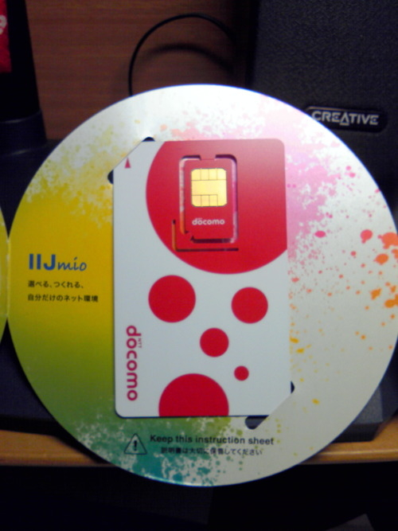

<a href="/entry/2012/05/13/123300">こないだ申し込みをした</a> "IIJmio 高速モバイル通信/D ミニマムスタート128プラン" の SIM が届いたので、手元の SH-12C に挿して使ってみた。  
日曜日の夕方に申し込んで、水曜日に板橋区の自宅に届いた。

LTE 対応の赤色ドコモ UIM カード。こんな感じの台紙に入ってた

Twitter とメール送受信と Web 閲覧くらいしかしてないけど、大して遅い訳でもなく、思ってた以上に快適だった。  
Twitter の UserStreams も 3, 4 本同時に接続できた。Wi-Fi 接続と比べると多分いくらか遅れて受信してるけど、大して気にならない。  
USB テザリングも、普通に大丈夫だった。  
YouTube は HQ にするとかなり重いが (sp モードでもそうだった)、低画質モードだと止まりながらもまあまあ見れた。

128 Kbps でも予想以上に良かったので、SIM 入ってないスマホ持ってる人にはぜひおすすめしたい。  
小遣いに余裕ができたらそのうちクーポンチャージも試してみようと思う。
