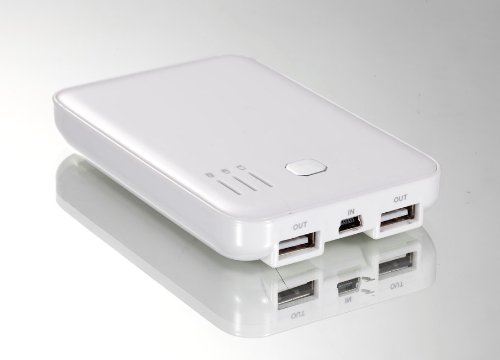
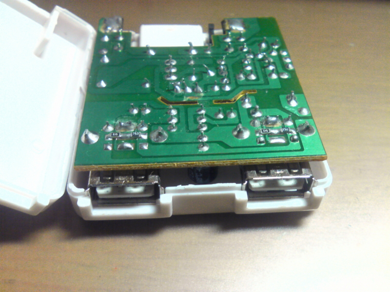
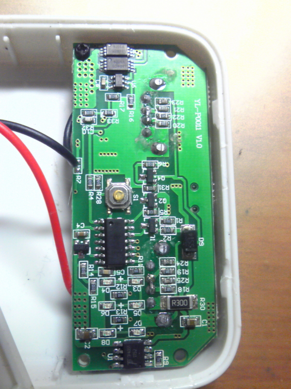

ちょっと前に上と同じタイプの USB モバイルバッテリーを買った。値段の割に容量も大きくて便利に使ってたんだけど、1 つ困ったことがあった。

USB 通信ケーブルで繋いで手持ちの Android 端末を充電しようとすると、端末が「カードリーダーモード」になってうまくいかない。AC からの充電器なら通信ケーブルでもちゃんと充電できるのに…。

仕方なく通信ケーブルと充電専用ケーブルを両方持ち歩いていたけど、僅かながらかさばるし、使い分けるのが面倒臭く不便である。

原因から書くと、USB はデータ線がショートしている場合は高速充電、していない場合は通信モードと決まっていて、このモバイルバッテリーでは USB のデータ線がショートしていないため「カードリーダーモード」になってしまうらしい。

例えば手元のこの機種では、PC に端末を挿すと最初に一瞬「カードリーダーモード」になったあと、PC がデータ線経由で何か連絡して、充電が開始される。データ線がショートしていない場合、まずはこのような段取りを踏まないと充電が開始しないことになっているらしい。

参考に、手元の AC-USB 充電器の 1 つの、スルーホールマウント型の USB コネクタだと、このように真ん中 2 つのデータ線部分が半田でショートされている。

そこで、このモバイルバッテリーの基板のデータ線部分も半田でそのままくっつけてショートさせることにした。他にもケーブルを細工して対処する方法などあるけど、持ち歩くケーブルを減らすのが今回の目的だし、そもそも既に持ってる充電ケーブルと同じなのでパス。

まずモバイルバッテリーのフタを外す。短辺に 2 箇所、長辺に3 箇所、計 10 箇所あるツメで固定されている。フタの裏に、リチウムポリマーバッテリー (3.7 V, 2,500 mAh) ×2 が並列で繋がれて固定されている。

そして上の画像の AC 充電器の様に中央 2 つのデータ線部分に半田をつけてショートさせる。

作業時間は数十秒。やっと半田こてが温まったところなのにもう終わりかよ！＞＜

でもこれで通信ケーブルでも「カードリーダーモード」にならずに充電出来るようになった。

ここまで書いたけど、基板とかはあまり詳しくないので、どっか間違ってたら教えて欲しい。今のところ爆発はしてない。

ところで数日後、Amazon でこんな商品を発見した。

[PLANEX Xperia 充電&データ転送 MicroUSBケーブル ブラック (ACアダプタ/パソコン接続切替スイッチ付)BN-XPERIASB](https://www.amazon.co.jp/dp/B0040GJXYY/?tag=4217986871-22)

このケーブルを使えば細工せずともそのまま使える気がする。
スイッチで通信用と充電専用とを切り替えられて、1 本 2 役で使えるらしい。最初からこれ使っとけば良かったかも。
