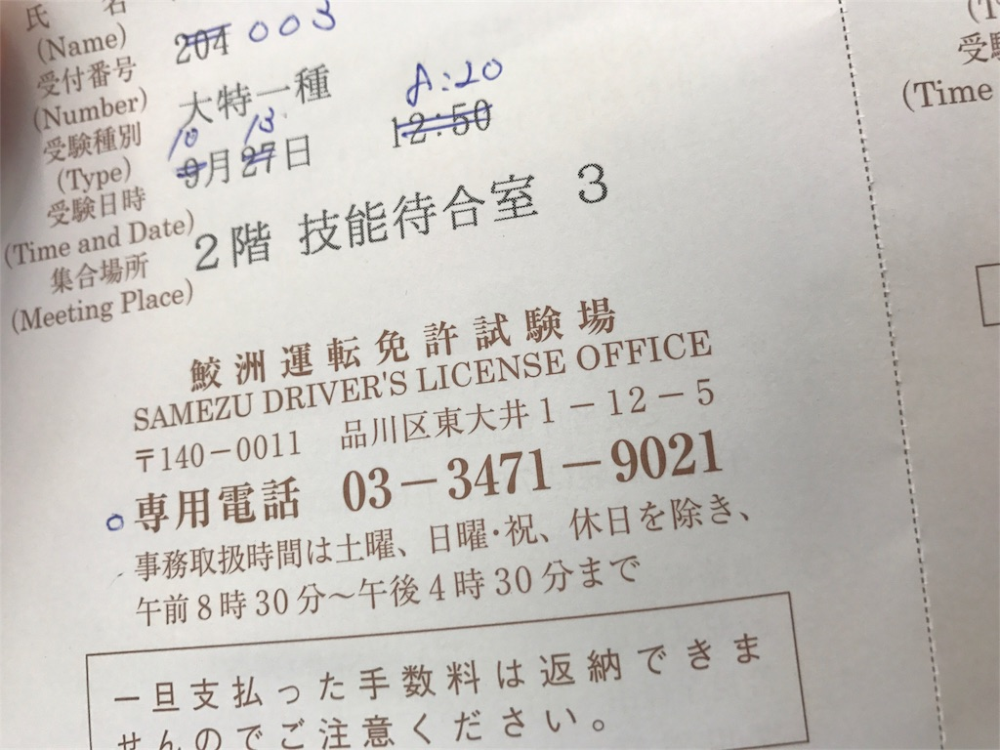
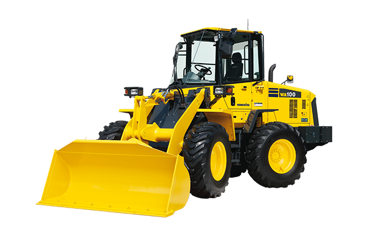
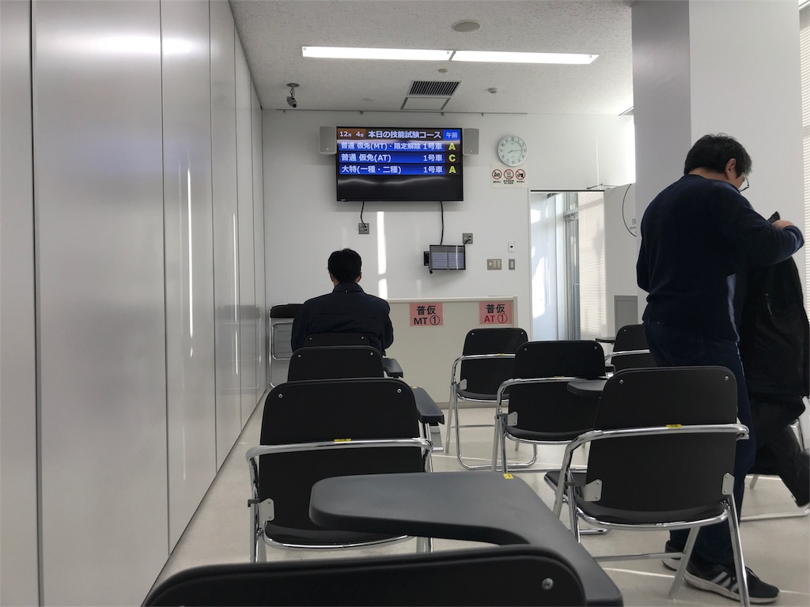
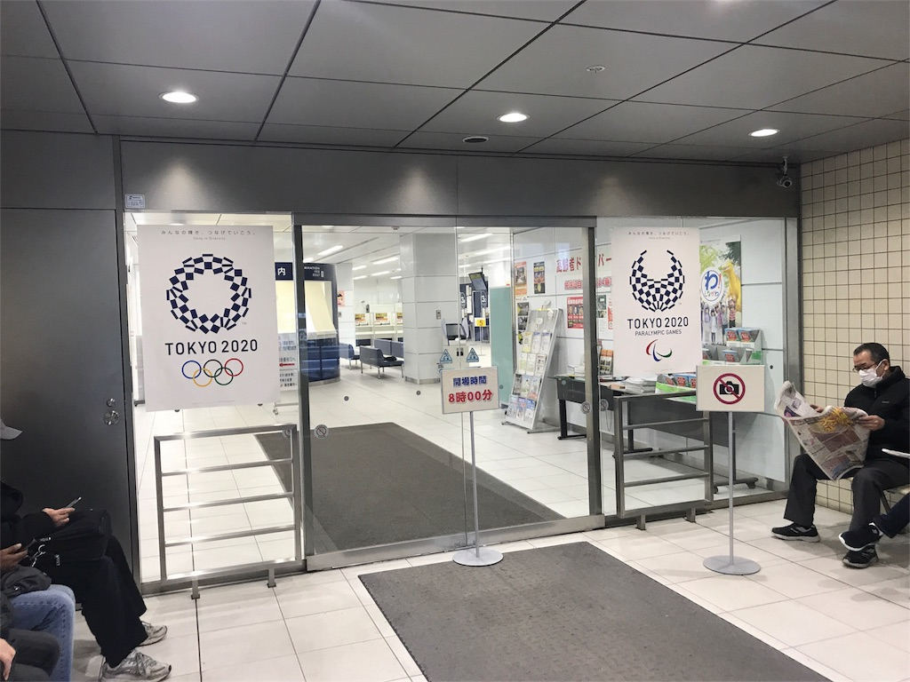
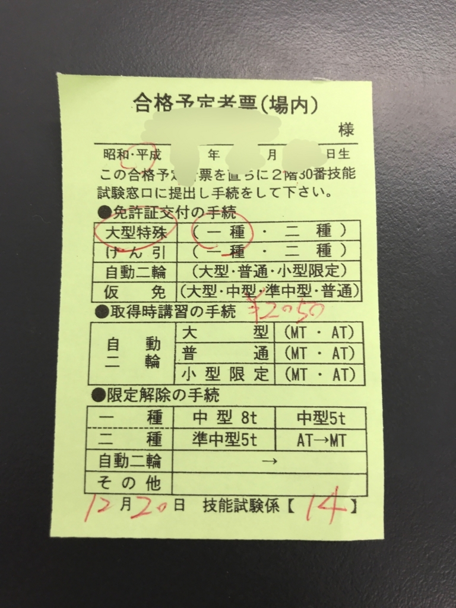
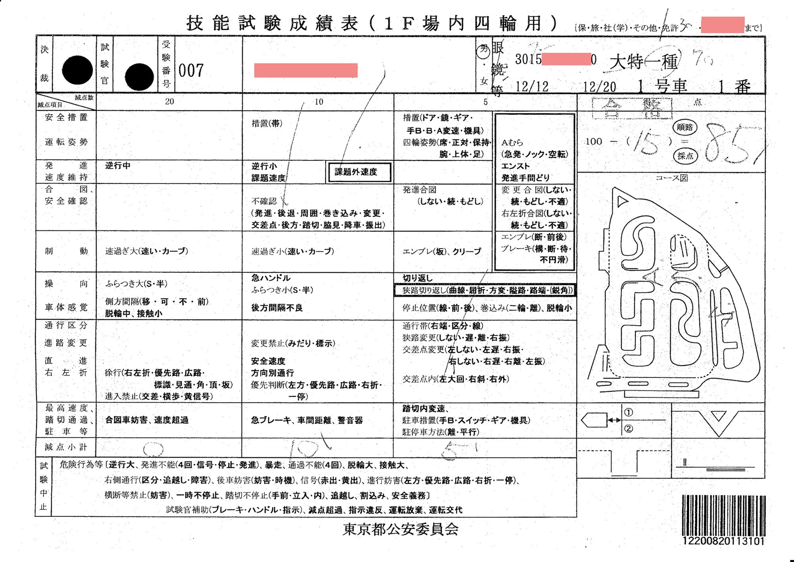

大型特殊自動車 [^1] 免許の飛び入り試験 [^2] を警視庁鮫洲運転免許試験場で受験したので、当時の記録を書いておく。  

### きっかけ

自動車免許の初回更新講習を数ヶ月後に控えていたタイミングで、平日昼間に時間が取れるようになった。  
初回更新講習は 2 時間ぶっ通しで安全運転の有難いお話を聞くらしい。  
講習でありきたりに更新するよりも、普段運転する機会のない重機を乗り回すことができ、更に合格すれば免許証の期限が延びて、かつ免許の車種が増えるほうが絶対に面白いと考えた。  
そこで、前々から興味があった大特一種の一発試験を受けてみることにした。  
この免許があると重機を公道で運転することができるようになるので、ドライブの選択肢が広がる。  
試験についての詳細は下記参照。  
[大型特殊免許試験(直接試験場で受験される方) 警視庁](http://www.keishicho.metro.tokyo.jp/menkyo/menkyo/annai/ogatatokushu/tetsuzuki07.html)
   
### 2017/09/12
ふと思い立ち、鮫洲運転免許試験場に適性検査の受験と技能試験の予約をしに来た。  
   
1 番窓口で大特一種の受験と告げる。  
教習所の卒業証明書があるか聞かれるので、ないと答える。  
   
指定教習所の卒業証明を持っていると試験場の技能試験は免除になり、他の一種免許を持っていれば学科も免除になるので、視力検査のみで併記 [^3] ができる。  
一般に知られているのはこの教習所ルートだが、今回は教習所に行かず試験場で技能試験を受ける。  
   
既存免許を呈示すると併記の申請書をもらえるので、記入台で記載事項を埋めた。  
ふらっと来たせいで証明写真を持っておらず、施設内にある 800 円の写真機を使う羽目になった。  
   
記入したら 2 番窓口で手数料を払う。受験料 2950 円。  
貸車料、交付手数料はそれぞれ技能試験受験日、合格後の交付手続きの際に払うようになっている。  
   
受験料を払ったら 3 番窓口で適性検査を受けた。  
大特一種の視力検査は普通車と同じ基準で、0.7 が見えれば大丈夫。  
深視力検査はないので普通免許持ちなら問題ないだろう。  
   
係員に適性検査 OK の印を押してもらったら、2F の一番奥の技能試験予約窓口に行く。  
既に準中型 (5t 限定) を持っているので学科は免除だった。  
   
技能試験窓口に申請書を渡して、A4 の紙に両面印刷された『受験の手引き』を受け取る。  
これには技能試験を受けるための基本的な心得が書いてある。  
   
カードリーダーのついた iMac G3 みたいな機械に既存免許を通して、希望の日時に予約を入れる。  
曜日によって 8:50 集合の回と 12:50 集合の回があった。  
早朝集合のものしかないと思っていたので、昼からの枠があるのは助かる。  
最短は約 2 週間後だった。  
   
朝は弱いので最短ではないが 12:50 集合の日を選んだ。  
係員から受験票を受け取り、今日のところは帰宅。  
   
### 2017/09/27
12:50 集合だが、20 分くらい遅刻してしまった。  
   
とりあえず技能窓口に受験票を持っていくと、今日はもう出発したから日程変更の予約をするように言われた。  
予約の機械に免許証を読ませると空いている日時が表示される。  
約二週間後の 8:20 と約四週間後の 12:50 が空いていて、四週間待ちはちょっと長すぎるので朝早いながら二週間後を予約。  
   
窓口の警察官が受験票を手書きで修正して渡してくれた。  

再度受験料がいるかと思っていたが、変更扱いでお金はかからなかった。  
   
この日はもう予定がないので、1F のカーテンをめくって大特技能試験の様子を眺めていた。  
案内の係官がウロウロしていたが、特に注意はされなかったので覗いても特に構わないのだと思う。  
コースの 2 階 (建物の 2.5 階くらいの高さ？) では普通車の技能試験をやっているようだった。2 階があるので、大特で使う 1 階のコースは雨の日でも路面が濡れないのではないかと思う。  
また、府中試験場に比べるとコースが大分狭いので、ルートの把握がしやすそうに感じた。  
大特の試験車両はコマツの WA100 で、ピカピカできれいな車だった。  

   
### 2017/11/10
試験のことを失念していて、予約していた 10/13 からほぼ 1 ヵ月過ぎてしまった。  
   
この先日、本籍と苗字が変わり免許証の書き換えをするにあたって、試験のことを思い出した次第だった。  
新しい住民票を持って 4 番窓口で免許証の記載事項変更の手続きを済ませ、技能窓口へ向かった。  
   
試験の再予約をするとともに、本籍と苗字が変わったことを伝えて処理してもらう。  
試験中に氏名が変わる人もなかなかいないのではないかと思う。  
   
初日に出した受験申請書の原本が奥の棚から出てきて、氏名の変更を追記。  
本籍については申請書に記載するところがないので、技能試験窓口の警察官が免許証のコピーを取り直していた。  
最後に受験票の日付と氏名を二重線で書き換えてもらった。予約を 2 回取り直して苗字まで変わったので訂正だらけで大変だ。  
   
予約は 4 日後の 12:50 で取れた。  
   
施設内にある列車非常停止ボタンのサンプルが面白かった。  
後日気づいたがこのときは電源が入っていなかった。  
https://twitter.com/wk/status/928806521130991619  
   
### 2017/11/14
ちょっと寝坊して、乗る予定だった丁度いい時間で到着するバスが目の前で行ってしまった。  
タクシーに切り替えて、余裕で到着。   
   
手数料窓口で貸車料 1,550 YEN を払って待合室に行く。  
手数料窓口はちょっと混んでたので予定のバスで来てたら集合ギリギリだっただろう。  
   
今回やっと技能試験を実際に受けることになる。  
前方にホワイトボードとディスプレイがある教室のような部屋が待合室で、席の列ごとに受験種別が別れていた。  
大特を受ける人は自分の他に 3 人いた。  
同じ待合室には 6 名の普通 (AT) 仮免受験者もいた。  
場内のみの試験の受験者を集めた待合室のようだった。  

   
初回受験では試験順が最後になると噂に聞いていたが、今回はその通りだった。  
   
ディスプレイに自分の順番の数字が表示され、階段を降りて 1F の試験コースへ行く。  
運転してみたところ、ハンドルに遊びがなく、微妙に動かすだけでもすぐ方向が変わってしまうので、かなりふらついた。  

1. ハンドルの向きがちょっと右に寄ってる
1. 左に軌道修正
1. 今度は左すぎる
1. 右に軌道修正
1. (1 に戻る)

という感じ。  
ふらつきやすいことは知っていたので気をつけているつもりだったが、実際に乗ってみると難しい。  
   
踏切通過のときは窓を開けて音を聞くのが定番だが、大特車は腕を伸ばしてやっと届くあたりに窓があるので開けづらい。  
手を伸ばして窓を開ける意志を示せば OK のようだった。  
シートベルトを締める前に窓を開けておいたほうがいいとか、窓に手が届かないのでドアを開けるという記事もネット上では見かけたが、ここではその必要はないようだった。  
   
ある程度走って、方向転換の途中で脱輪した。  
内輪差がないので、普通車の感覚でハンドルを切るとかなり内側に寄ってしまう。  
このあたりで持ち点が尽きたようで途中帰着。  
   
試験官から、まずはふらつきをなくしてまっすぐ走れるようにとのアドバイス。  
自分としてはホイールローダーがどんなものかわかったのでまあ今日はいいだろうという感じ。  
   
今日の大特は 1, 2 名が受かったようだった (よく見てないので合ってるかは知らない)。  
   
不合格者はそのまま技能窓口へ行き、次回の予約をして帰る。  
3 週間後の予約を取った。だいぶ間が空く。  
キャンセル待ちがあるといいのにと思った。  
   
数ヶ月後には今の免許証の期限が来る。  
それまでに合格して、2 時間の初心者更新講習を回避したい。  
   
https://twitter.com/wk/status/930300422933291008  
   
### 2017/12/04
集合が 8:20 なので、気合いで早起きした。  
7:30 過ぎに試験場に着いて、向かいのすき家で朝食にした。  
8:00 の開場まで入口の風除室で待った。  

   
貸車料を納める手数料窓口は 08:15 からだが、開門からの 15 分の間にかなり並んでいた。  
開場前に試験場に着いておいて、すぐ並ぶのがよさそうだと思った。  
   
今日の大特受験者は 4 人で、一番最後の順番だった。  
   
今回は完走できた。  
前回ひどかったふらつきは、ハンドルを細かく調整しないようにしつつ、緩やかに操舵することで改善した。  
   
試験後の講評では左折大回り、加速不良、ふらつきを指摘された。  
ふらつきは直線では出なかったが、障害物回避や幅寄せのときのハンドル操作が過剰でふらついているとのこと。  
   
難しい課題ではないように思われたので、これらを直せば合格できそうだった。  
10 回くらいは受ける覚悟でいたので、思ったよりは早く取得できそう。  
   
次回は 12/20 を予約。  
   
https://twitter.com/wk/status/937486644516499456  
   
### 2017/12/12
12/11 の夕方にふと「もっと早い日程空いてませんか」と技能試験窓口に電話してみたところ、「たまたま明日空いている」とのことで急遽。  
電話口で空いているのはたまたまであると何度か言われたので、いつでもこう上手いこと予約できる訳ではないんだぞという意思を感じた。  
   
12:50 からの回。  
少し早目に着いて受験料を払うなどした。  
   
順番は 1 番目。過去 2 回の試験コースは A コースだったが、今回も A コースの表示。  
A コースしか当たらないのだろうかと思った。  
   
担当は気難しそうな試験官だった。  
   
発進時にバケットの安全レバー ((バケットの操作レバーをロックするレバー)) の入れ忘れを指摘された。  
ああ、今回は落ちたな、と思いながら発進。  
   
周回コースを少し進んだところで、前の 2 回と違うコースを指示される。  
減点超過でショートカット帰着の指示かと思ったが、後で確認したら B コースの順路だった。  
自分が見間違えていたのか、試験官が間違えたのか、あるいはこの時点で減点超過していてお情けで練習させてもらっていたのか、今となってはわからない。  
   
方向転換の課題を指示される。  
ハンドルのタイミングが早くて寄ってしまったが、転換は問題なくできた。  
   
方向転換から周回コースへ出る一時停止の標識で、エンジンブレーキだけで止まってから発進したところで補助ブレーキ。  
ここの時点で試験中止は確実になった。  
ブレーキペダルで明確に停止すべきだった。  
   
発着場まですぐの場所だったが、もう少しコースを進ませてもらえた。  
周回コースの直線では、ハンドルは細かく切るとふらつくからあまり動かすべきではないと助手席から補助ハンドルを取って指摘された。  
試験官が気難しそうにしていたのも相まって、補助ハンドルにはビビった。  
   
発着点に戻って停車措置。  
右手のバケット操作で左手をハンドルに置いたままにしていたところ「据え切りしない！ 地面に穴空いちゃうよ」と注意される。  
サイドブレーキも引いた上で駐車しようとしていたわけで、当然据え切りしようとしたわけではない。  
気づかないうちにハンドルを動かしてしまったのかと思い、動かさないように注意しながら持っているともう一度「据え切りしない！」と注意。  
ハンドルを持たないように言われ、なるほど、でも最初からそう言ってくれれば良いのに、と思いつつそうした。  
   
エンジンを切ったところで「何か忘れてない？」と聞かれる。  
心当たりがなく、考えているともう一度「何か忘れてない？」と聞かれたので、「分かりません」と答えた。  
バケット操作レバーのロックのかけ忘れだった。  
「また忘れるよ、気をつけて」と注意。  
第一印象は無愛想な試験官だったが、もう完全に怖い試験官にしか思えなくなっていた。  
   
講評では一時停止違反、発進時と停車措置の安全レバー忘れ、少しふらつきがあるとの指摘。  
安全確認はまずまずとのこと。  
乗車するときにドアオープンを最小限にしていたのだが、ドアを 180° 開けると固定されるからドアは全部開けるといいと教えてくれた。  
これは知らなかったので勉強になった。早速降車時にやってみた。  
   
励ますように「またお待ちしています。」と言って、不合格の予約票を渡された。  
降車してお礼を言ったら再度「またお待ちしています。」と言ってくれた。  
もしかするとこの試験官は普段から怖いと思われがちで、それをフォローするために優しそうな言葉をかけるようにしているのかなと思った。  
   
電話で変更する前と同じ、12/20 の予約が取れた。  
自分が昨日キャンセルした枠だと思う。  
結局予約は元どおりだが、B コースの道順やドアがロックできることを知れて収穫だった。  
   
### 2017/12/20
8:20 の回なので早起きした。  
   
7:30 くらいに試験場前に着いて、また向かいのすき家で朝食にした。  
前々回に風除室で開門待ちしたときに風除室でじっとしていると寒いと学んだので、空調の効いたすき家で少し長めに待機していた。  
   
今回の試験も一番目。  
今回は初めて (?) B コースが当たった。前回走らせてもらえてよかった。  
カーブや右左折で大回りに注意すること、ふらつきを抑えるためにハンドルを切りすぎずゆっくりと丁寧に操舵することを心がけた。  
今回はそつなく完走でき、駐車措置をしたあと、「降車して助手席側に来てください」と言われた。  
合格したなと思いつつ、気を抜かず安全確認などしながら降車して、助手席側のドアから試験官を待つ。  
氏名と生年月日と住所を尋ねられ、答えると、「合格です、待合室で待機しているように」という旨伝えられ、緑の紙を受け取った。  
https://twitter.com/wk/status/943276200562012161  

   
全員の受験が終わったあと、待合室で合格者への説明があった。  
今日の大型特殊技能試験の合格者は自分を含めて 2 人で、もう一人は二種免許だった。  
大特二種免許は面白くて、現在の日本でこれが必要になることはほぼ皆無で、教習所の課程も設定されていない。客を乗せて公道を走るための重機は滅多にないからだ。  
警察官から手順の説明を聞いたあと、技能試験窓口へ緑の紙を持っていき、新しい免許証のデータを打ち込んだ受験申請書を渡される。  
手数料を払ったり写真を撮ったりして、交付窓口に受験申請書を提出すると引換券を渡される。  
20 分程度待つと呼ばれて新しい免許証を受け取る。  
これで晴れて大型特殊の免許を取得したことになる。  
   
https://twitter.com/wk/status/943296872646565888  
https://twitter.com/wk/status/943297116654395392  
https://twitter.com/wk/status/943299992638205953  
   
### 成績表の開示請求
成績表には採点の内容が載っているので、開示してもらうことで自らの運転の弱点を知り安全運転に役立てたいと考えた (建前)。  
合格した足で霞ヶ関にある警視庁の本庁内の情報公開センターへ向かった。  
<s>別に警察署などでも開示請求はできるはずだが、</s> 一回本庁に入ってみたかった。 **警察署で開示請求できるのはその警察署内にある文書だけなので、試験場にあると思われる技能試験成績表は警視庁本庁でしか開示請求できない (2019/02/24 追記)**  
情報公開センターの警察官は請求すべき文書名を特定するのを手伝ってくれたり、請求の文言の書き方を一緒に考えてくれたりと親切だった。  

   
下記の文言で保有個人情報開示請求をした。  

> 私が鮫洲試験場で下記の日に大型特殊一種を受験したときの技能試験成績表  
> (1) 29 年 11 月 14 日、(2) 29 年 12 月 4 日、(3) 29 年 12 月 12 日、(4) 29 年 12 月 20 日  
> 免許証番号 3015-xxxx-xxx0  
   
年末年始を挟んだので開示まで数週間かかった。  
写しの交付は 1 枚 10 円で、4 回分 × 表裏 の計 8 枚なので、80 円を現金で払った。  
開示された文書は下記のようなものだ。  
スキャンしてホワイトバランスを調整して個人情報を隠すのが面倒なので処理済みの合格回だけ載せておく。  

   
走行中も走行後も特に問題点は指摘されず、特に失敗した心当たりもなかったので、開示を受けるまでもしかして満点ではないかとすら思っていたが、減点されていた。  
特に方向転換の後退不確認は盲点だった。  
<s>先に後方を確認してからリバースギアを入れるべきところ、癖ですぐにリバースにしたと思う。</s>  
**車庫を行き過ぎるときに車庫内の安全確認をしていなかった。二種免許の受験時に指摘されて気づいた次第。(2019/02/24 追記)**  
どこで何が減点されたかはっきり分かるのは良い。  
   
### 所感
思ったより期間はかかったが、受験回数は想定していたより少なく済んだ。  
試験車は AT なので、法規走行ができる人なら車両に慣れさえすれば難しくない試験だと感じた。  
教習所で大特免許を取ると 10 万円程度かかるが、その 5 分の 1 以下の値段しかかからなかったので大変満足している。  
大特二種も取りたいが、まだ最初に四輪免許を取得してから 3 年経っていないので、受験資格がなくもどかしい。  
しばらくして二種免許の受験資格が発生する頃は平日昼間にあまり時間が取れないことが予想されるので、まあ余裕ができたときにでも二種でまた受けたいと思う。  
   
[^1]: 公道を走行する建設車両、重機、農耕車両など
[^2]: 公認教習所の卒業による技能試験免除を使わず、警察の試験場で技能試験を受ける受験方式の俗称。一発試験、直接受験とも
[^3]: 既存の運転免許に他の未取得の種別を追加すること
