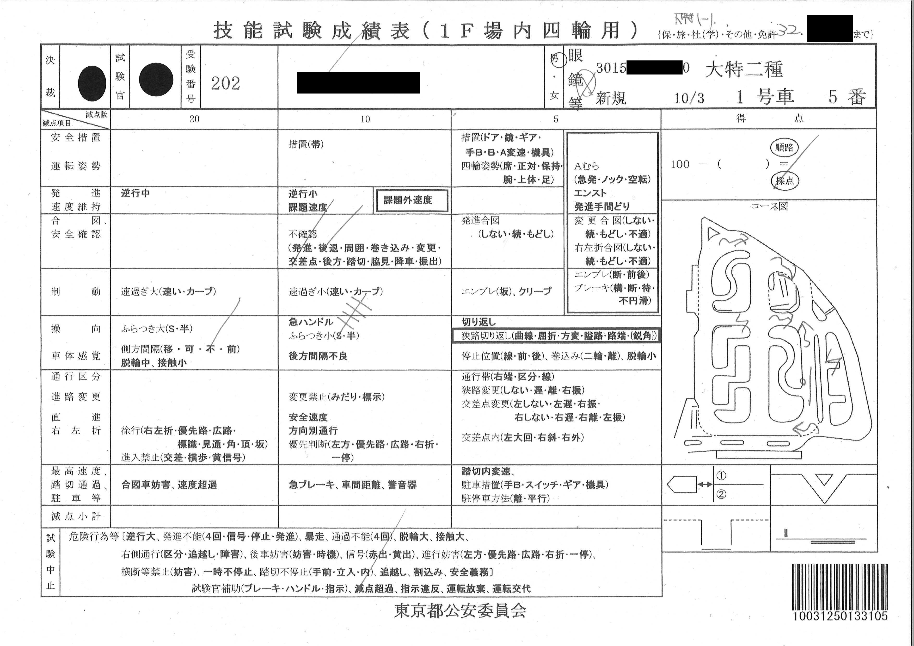
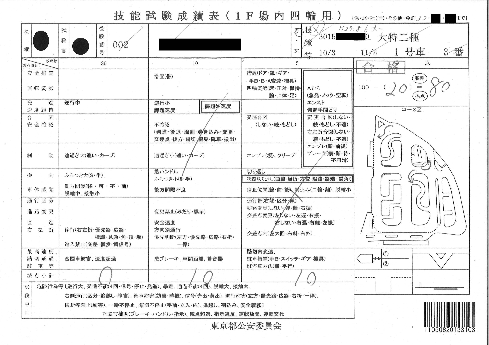

書こう書こうと思っていて半年以上過ぎてしまった。思い出したので書き残しておく。

## 2018-08-06

<blockquote class="twitter-tweet" data-lang="en">
一種免許を取得してちょうど 3 年になったので、二種免許を受験しにきた (@ 鮫洲運転免許試験場 in 品川区, 東京都) <a href="https://t.co/TaJg1ITcNP">https://t.co/TaJg1ITcNP</a> <a href="https://t.co/Ryd4HIRTZ0">pic.twitter.com/Ryd4HIRTZ0</a>
&mdash; wk (@wk) <a href="https://twitter.com/wk/status/1026298477083418624?ref_src=twsrc%5Etfw">August 6, 2018</a></blockquote>

のんびりしてたら午後になってしまった。  
学科試験窓口に申請書を出したらちょっとしばらく待っていてくださいと言われ、奥の方から「大型二種？」「取得日を 1 日目と数えるから」などど聞こえてきてから受理された。

<blockquote class="twitter-tweet" data-lang="en">
二種学科試験、合格者が自分一人で面白かった　午後試験だから午前落ちた人が多くて合格率が低くなるのだろうと思った
&mdash; wk (@wk) <a href="https://twitter.com/wk/status/1026344905503694848?ref_src=twsrc%5Etfw">August 6, 2018</a></blockquote>

## 2018-10-03

<blockquote class="twitter-tweet" data-cards="hidden" data-lang="en">
受験申込から 2 ヶ月くらい経ってしまったが、大型特殊二種の１回目の技能試験を受けに来た (@ 鮫洲運転免許試験場 in 品川区, 東京都) <a href="https://t.co/RnqW8nRFN7">https://t.co/RnqW8nRFN7</a>
&mdash; wk (@wk) <a href="https://twitter.com/wk/status/1047332237723750405?ref_src=twsrc%5Etfw">October 3, 2018</a></blockquote>

大特二種 1 回目。2017/12/20 に鮫洲で大特一種を取得したときぶりのホイールローダー。  

運転感覚を忘れていてかなりふらついてしまった。成績表からもふらつきの減点がかなり取られていることが見てわかる。
コース図の中の波形矢印がふらつきの減点箇所である。  
他にも、安全確認不良 (Z 字型の記号)、側方間隔不適 (◯ 印のところに障害物) の減点がある。

## 2018-11-05

<blockquote class="twitter-tweet" data-lang="en">
大特二種技能試験 2 回目 (@ 鮫洲運転免許試験場 in 品川区, 東京都) <a href="https://t.co/uttmavHd67">https://t.co/uttmavHd67</a>
&mdash; wk (@wk) <a href="https://twitter.com/wk/status/1059239196085440513?ref_src=twsrc%5Etfw">November 5, 2018</a></blockquote>

大特二種 2 回目。  
1 回目とちょっと間が空いてしまったが、前回がいいリハビリになったので、合格点が取れた。

幹線道路のカーブでハンドルを切り過ぎてふらついてしまったのと、左折の幅寄せが甘いところが 2 箇所 (カーブ矢印) あった。

<blockquote class="twitter-tweet" data-lang="en">
二種免許受有のオタクと化した <a href="https://t.co/MWHAUYuMs9">pic.twitter.com/MWHAUYuMs9</a>
&mdash; wk (@wk) <a href="https://twitter.com/wk/status/1059267102211682305?ref_src=twsrc%5Etfw">November 5, 2018</a></blockquote>
