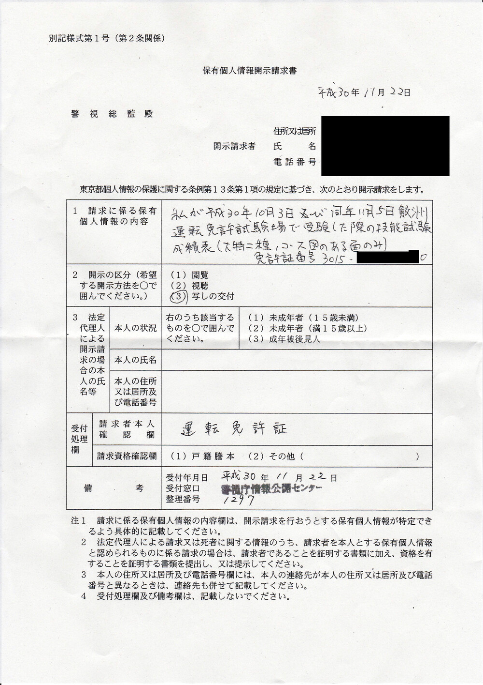
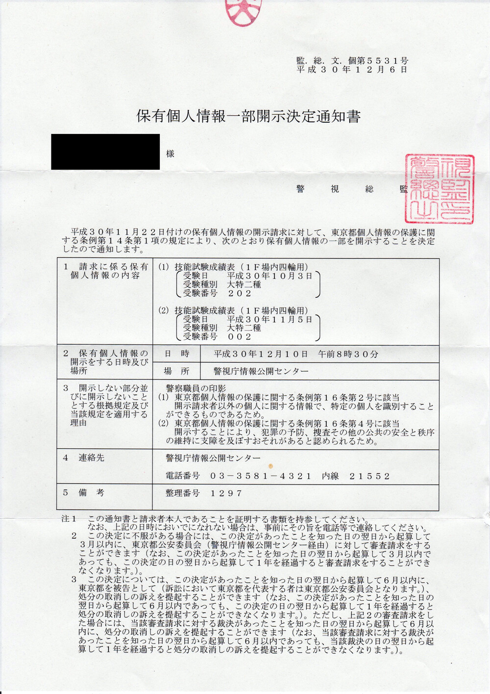

ブログに書こう書こうと思っていて半年以上過ぎてしまった。書いてなかったのを思い出したので書き残しておく。  

[2017 年に鮫洲で大特一種を受けた](/entry/daitoku-samezu/) が、二種の受験資格ができたらまた受けに来たいと思っていた。
普通免許取得から無事 3 年が経過して、二種の受験資格ができたので、大特二種も取得することにした。  

大特二種は建設用や農業用車両、キャタピラー車などが分類される「大型特殊自動車」で旅客営業をするための免許で、そのような車は現存しない。
いちおう、戦後に九五式軽戦車が雪上バスに転用された事例があったらしい。
こういうのが現存すれば大特二種 + 牽引二種免許が必要になると思う。
そんな感じの自動車免許である。

<blockquote class="twitter-tweet" data-conversation="none" data-lang="en">
そうそう、先日北海道中央バスの歴史を本にした記事の中で95式の更生戦車の写真が載っていたのを見つけました。中央バスにこの生写真って残ってるんですかね(´･_･`) <a href="https://t.co/nAfZgXS3So">pic.twitter.com/nAfZgXS3So</a>
&mdash; ☆ルーチェ＠エクレア㌠☆ (@jzs175zcrownpc) <a href="https://twitter.com/jzs175zcrownpc/status/885708986640506880?ref_src=twsrc%5Etfw">July 14, 2017</a></blockquote>

## 2018-08-06 受験申請・学科試験

<blockquote class="twitter-tweet" data-lang="en">
一種免許を取得してちょうど 3 年になったので、二種免許を受験しにきた (@ 鮫洲運転免許試験場 in 品川区, 東京都) <a href="https://t.co/TaJg1ITcNP">https://t.co/TaJg1ITcNP</a> <a href="https://t.co/Ryd4HIRTZ0">pic.twitter.com/Ryd4HIRTZ0</a>
&mdash; wk (@wk) <a href="https://twitter.com/wk/status/1026298477083418624?ref_src=twsrc%5Etfw">August 6, 2018</a></blockquote>

のんびりしてたら午後になってしまった。  
学科試験窓口に申請書を出したらちょっとしばらく待っていてくださいと言われ、奥の方から「大型二種？」「取得日を 1 日目と数えるから今日から受験できる」などど聞こえてきてから受理された。  

<blockquote class="twitter-tweet" data-lang="en">
二種学科試験、合格者が自分一人で面白かった　午後試験だから午前落ちた人が多くて合格率が低くなるのだろうと思った
&mdash; wk (@wk) <a href="https://twitter.com/wk/status/1026344905503694848?ref_src=twsrc%5Etfw">August 6, 2018</a></blockquote>

## 2018-10-03 技能試験 1 回目

<blockquote class="twitter-tweet" data-cards="hidden" data-lang="en">
受験申込から 2 ヶ月くらい経ってしまったが、大型特殊二種の１回目の技能試験を受けに来た (@ 鮫洲運転免許試験場 in 品川区, 東京都) <a href="https://t.co/RnqW8nRFN7">https://t.co/RnqW8nRFN7</a>
&mdash; wk (@wk) <a href="https://twitter.com/wk/status/1047332237723750405?ref_src=twsrc%5Etfw">October 3, 2018</a></blockquote>

大特二種 1 回目。2017/12/20 に鮫洲で大特一種を取得したときぶりのホイールローダー。  

運転感覚を忘れていてかなりふらついてしまった。成績表からもふらつきの減点がかなり取られていることが見てわかる。
コース図の中の波形矢印がふらつきの減点箇所である。  
他にも、安全確認不良 (Z 字型の記号)、側方間隔不適 (◯ 印のところに障害物) の減点がある。

## 2018-11-05 技能試験 2 回目

<blockquote class="twitter-tweet" data-lang="en">
大特二種技能試験 2 回目 (@ 鮫洲運転免許試験場 in 品川区, 東京都) <a href="https://t.co/uttmavHd67">https://t.co/uttmavHd67</a>
&mdash; wk (@wk) <a href="https://twitter.com/wk/status/1059239196085440513?ref_src=twsrc%5Etfw">November 5, 2018</a></blockquote>

大特二種 2 回目。  
1 回目とちょっと間が空いてしまったが、前回がいいリハビリになったので、合格点が取れた。

幹線道路のカーブでハンドルを切り過ぎてふらついてしまったのと、左折の幅寄せが甘いところが 2 箇所 (カーブ矢印) あった。

<blockquote class="twitter-tweet" data-lang="en">
二種免許受有のオタクと化した <a href="https://t.co/MWHAUYuMs9">pic.twitter.com/MWHAUYuMs9</a>
&mdash; wk (@wk) <a href="https://twitter.com/wk/status/1059267102211682305?ref_src=twsrc%5Etfw">November 5, 2018</a></blockquote>

## 2018-11-22 成績表開示請求

出勤前に霞が関の警視庁本庁に寄って、技能試験成績表の開示請求をした。  

技能試験成績表は両面印刷だが、今回は表面だけを請求することにした。
裏面は自分で記入した住所氏名等と受験上の注意が書いてあるだけなので、新しい情報がなく、もらってもさほど嬉しくない。  

窓口の警察官にアドバイスしてもらいながら、下記のような文言にした。

> 私が平成 30 年 10 月 3 日及び同年 11 月 5 日鮫洲運転免許試験場で受験した際の技能試験成績表  
\(大特二種、コース図のある面のみ\)  
免許証番号 3015-xxxx-xxx0

「表面」と書こうと思ったが、どちらを表だとも取れなくもなく、解釈の余地が生まれる気がしたので、「コース図のある面」と書いた。
\(窓口の警察官は「表面で大丈夫ですよ」と言ってくれていて、実際大丈夫そうな雰囲気ではあったのだけれど。\)

自分の手書き文字のバランスが悪いのが気になる。警視庁の HP に様式があるので、文言が最初から決まっているなら印刷して持って行った方が良いと思う。

## 2018-12-10 成績表開示受け取り

朝一に警視庁に寄って技能試験成績表の写しを受け取り。  
下図は開示決定通知書。
日時は決定通知を出す前に電話で打ち合わせてくれる。
郵送はできないので取りに行く必要がある。

細かいことは忘れたが、一定の職位以下の警察職員の印影は不開示になる決まりらしい。
自分としても知りたいのは成績の方なので、 印影とか担当者名には別にこだわらない。

## 所感

また気が向いたらビットを増やしに行きたい。普通二種、牽引一種、普通自動二輪あたりを検討している。
