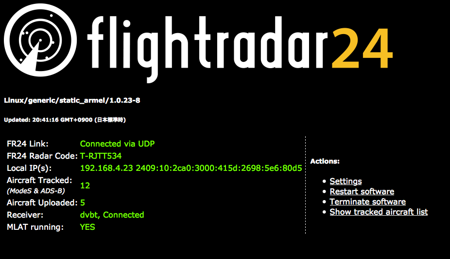
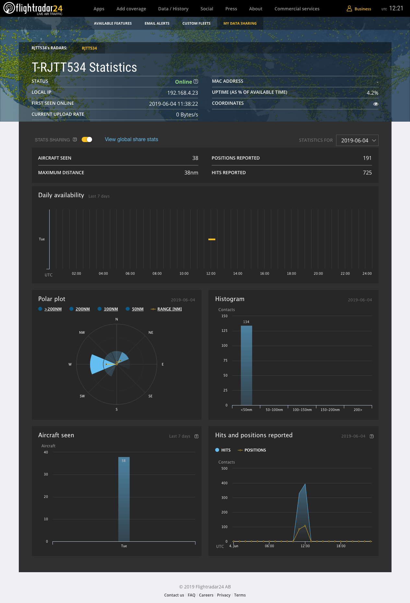

4 月に引っ越して、前の家は建物に挟まれた低層階だったので電波を出したり受けたりして遊ぶには
条件が悪かったのだけど、今度は開けた高層階になったので都合がよくなった。
とりあえず ADS-B 受信用のアンテナを設置して、有名な航空機トラッキングサイト、
[Flightradar24](https://www.flightrader24.com/) の feed (データ提供) をしてみることにした。

これをすると何が嬉しいのかというと、まず自宅周囲の航空機等の 2 次レーダーの電波を
直接傍受・解析できて楽しいというのと、このデータを FR24 に提供することによって
年 500 ドルの最上位プランが無料で使えるようになって便利というのがある。

ソフトウェアは Raspberry Pi に載せるとして、電波を受信するためのハードウェアをいくつか揃える必要がある。
全部 AliExpress から注文した。

いまここで計算したら 3,000 円くらいだった。

| item | price (JPY) |
|------|-------|
| アンテナ | 900 |
| ケーブル | 200 |
| 接栓アダプタ | 100 |
| アンテナ固定金具 | 500 |
| チューナー | 1000 |

ベランダの手すりにアンテナを固定して、エアコン用のダクトにケーブルを通して室内に引き回して設置した。

ソフトウェアの設定の方は [公式サイトの手順](https://www.flightradar24.com/share-your-data) を
そのまま実行したらインタラクティブに設定が完了して特に悩むこともなかった。

起動画面

起動して 40 分くらい経ったときの Statistics の画面。とりあえずデータが溜まり始めているのがわかる。

Statistics は公開する設定にしてみているので、ログインしていれば多分下記 URL から見られるのではないか。  
https://www.flightradar24.com/account/feed-stats/?id=8885

設置前に機材をテストしたときの感じでは、空が見える方角では 100 km 以上先の電波も受信できていた。
このあたりはアンテナの角度や高さ、アンテナ自体の性能を工夫すれば改善できそうな気がする。

設置完了して動作もしたので、これからはしばらく様子をみて、調整したりとか続けるかどうか検討するとかをしたい。
