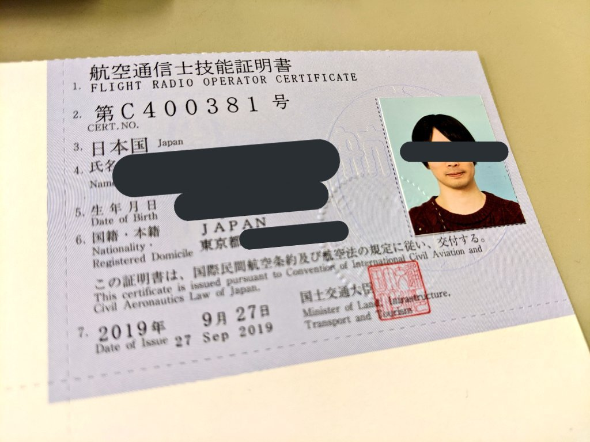
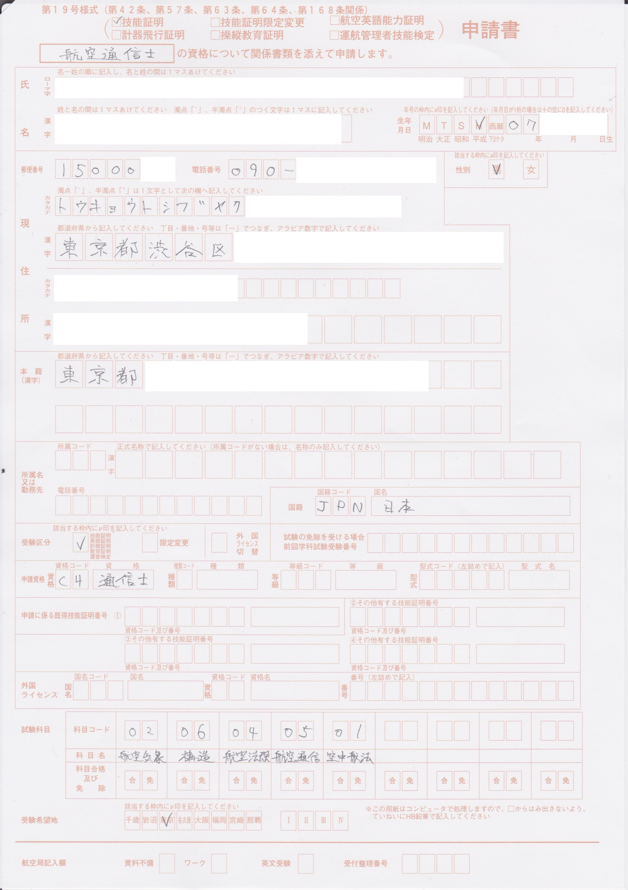
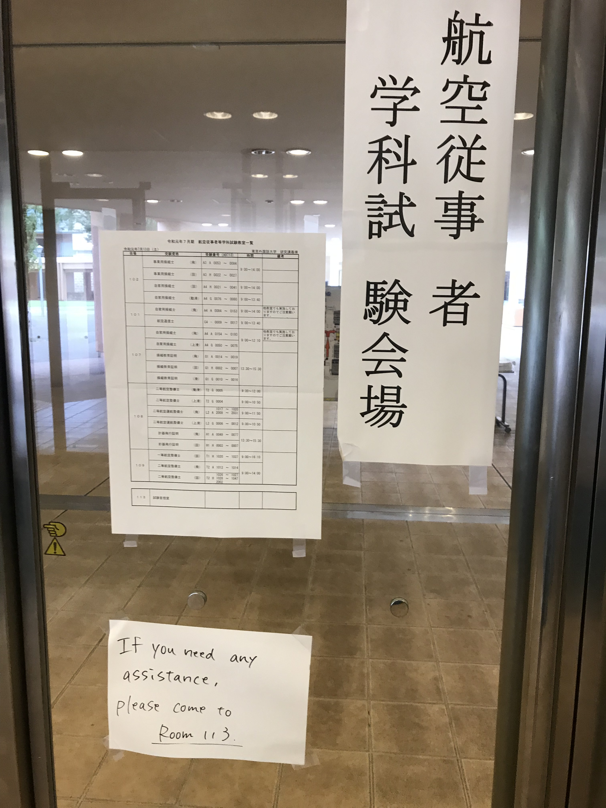
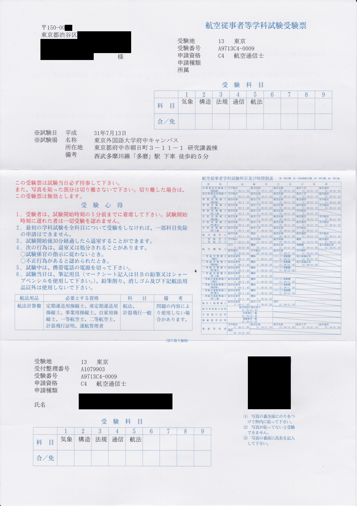
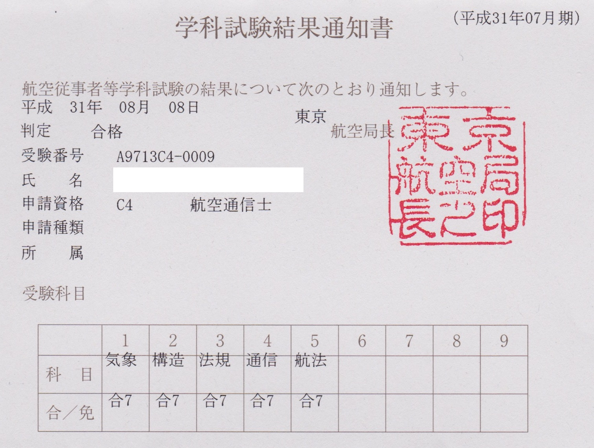
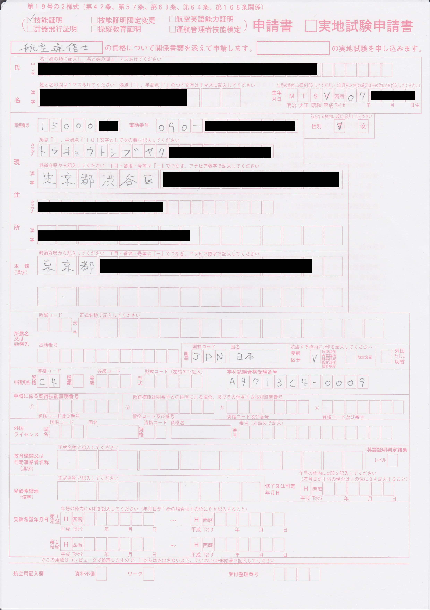

[大特二種](/entry/daitoku2) に続いて使えない免許シリーズ。  
取得者が少ないこともあって Web にあまり情報がないので、誰かの参考になればと思いできるだけ詳細に経緯を書き残しておく。

## これは何

航空通信士は航空法に規定された航空従事者の一種で、業務範囲は「航空機に乗り組んで無線設備の操作を行うこと」[^1]。  
機長 (正操縦士)、副操縦士、航空機関士、航空士、航空通信士の 5 人で飛行機を飛ばしていた時代の役職で、
現代では 2 人の操縦士が全ての操作をするのでこの資格が必要になることがないらしい。

電波法の「航空無線通信士」と名前が似ているが別の資格である。

これを取得する副作用的なメリットとしては

- 他の航空従事者資格を受験するときに学科試験の通信などの科目が免除される[^2]
- 航空身体検査証明を受ければ改めて身体検査を受けずに航空機操縦練習許可書を申請できる[^3]

というのがある[^4] が、一般人にはあまり関係がないし、航空従事者志望でもあまり大きい利点ではなさそう。
結果として、国際民間航空条約の規定に基づいて設けられていて通用力のある割には、あまり使い道がない資格になっている。

航空従事者資格のうち、航空通信士だけは実技試験がなく、学科試験合格と電波法の「航空無線通信士」の免許[^5] の
2 つが揃えば技能証明を受けることができる。したがって、航空従事者技能証明の中で一番取得しやすいと言ってよいだろう。

航空通信士技能証明を取得して、さらに有効な航空身体検査証明を併せて持つことで、航空機乗組員としての乗務が可能になる。

ちなみに、飛・回・船の操縦士などを持っていると学科試験が全科目免除になる[^2] ので、書類手続だけで取得できる。
操縦士の操作範囲に通信は含まれているので一見無意味だが、航空通信士には種別や限定がないので、
取得することで例えば自家用の操縦士でも事業用の航空機で通信ができるようになる。
実用上はともかくとしても、操作範囲は広がることになる。

一方で、自家用操縦士と併せて持つ場合にはデメリットにもなりえる。
自家用操縦士だけを取得している人の第二種航空身体検査証明の有効期限は年齢によって最大 5 年だが、
航空通信士を持っていると「自家用操縦士だけ」から外れてしまうので、第二種身体検査証明の有効期限が 1 年になってしまうと思われる (たぶん)[^6]。

## 2019-05 申請書類の入手

申請書の様式は OCR 用のマークシート式になっていて、国土交通大臣の定める基準に適合するものを使う必要がある[^7]。
個人でマークシートの印刷基準を満たすのは面倒そうだが、民間で既製品が販売されている。
[鳳文書林出版販売](https://www.hobun.co.jp/) の通販「[鳳文ブックス](https://www.hobun-books.com/)」から下記の 2 点を宅配で注文した。

- [学科申請セット(第19号様式)](https://www.hobun-books.com/products/detail.php?product_id=172) -- 学科試験の申し込みに使用
- [技能証明申請セット(第19号の2様式)](https://www.hobun-books.com/products/detail.php?product_id=173) -- 学科試験合格後の発行申請に使用

セットに頼らずバラで買う場合は、

- 学科試験申請
  - 第 19 号様式
  - 指定窓付封筒 -- 2 枚 (航空局が受験票や試験結果を送ってくる封筒)
  - 納付書 (任意 -- [航空法施行規則 第 31 号様式] を A4 普通紙で印刷すれば済むはず)
  - 板紙封筒 -- 1 枚 (任意 -- こちらから申請書を送る用の封筒。窓口持参なら不要。使用しなくても不備にはならないと思われる)
- 交付申請
  - 第 19 号の 2 様式
  - 指定窓付封筒 -- 1 枚
  - 板紙封筒 -- 1 枚 (任意 -- 同上)
- 共通
  - 『申請にあたっての注意事項』(任意 -- 目を通した方がよいが、提出するわけではない)

があれば航空通信士の申請には足りる。
バラで買うと書類代や送料を抑えられるかもしれない。セットで買うと不足がなくて安心。自分はセットで買った。

買える店はいくつかある。購入先を探しているときに見つけた分をリンクしておくが、多分他にもある。

- http://busterclimb.ocnk.net/product/204
- http://www.fs-cima.co.jp/pilothouse3.html
- http://pilothouse.jp/shop10.htm

## 2019-06-10 受験申請

航空通信士の学科試験は年 2 回、3 月と 7 月に実施されていて、
試験日の 1 ヶ月前ごろの 1 週間程度の間だけ申し込みを受け付けている。
スケジュールや書類の作成要項は [国土交通省の HP](https://www.mlit.go.jp/koku/koku_tk12_000005.html) に載っている (必読)。

申請書は上記の画像のように作成した。

せっかくなので東京航空局へ直接書類を提出しにいった。
地下の売店で手数料 5,600 円分の印紙を購入して、運用課検査乗員係にある窓口へ。

申請書の記入で迷ったところが、「所属名又は勤務先」の欄である。
というのも、自分の所属先は航空とも今回の受験とも何も関係がないので書いても仕方がないし、
所属がなければ受けられない試験でもないはずだ。提出の際に窓口で聞いたところによると、

- Q: これはどのように書くのがよいか
  - A: 受験票や結果通知書に印字される
  - A: 書類不備などの電話連絡で本人に繋がらない場合ここに記入した番号で連絡を試みる可能性がある
- Q: 「個人」と書いてもよいか
  - A: 構わない

ということだったので、その場で「個人」と書いて電話番号は空欄にして提出した [^8] 。
不備がないかチェックしてもらって申請完了。

<blockquote class="twitter-tweet">
モンスターエナジーが 160 円なの珍しいな (@ 九段第2合同庁舎 in 千代田区, 東京都) <a href="https://t.co/E0BNOu4Bx7">https://t.co/E0BNOu4Bx7</a> <a href="https://t.co/IivXzw4oUu">pic.twitter.com/IivXzw4oUu</a>
&mdash; (@wk) <a href="https://twitter.com/wk/status/1137887315152527361?ref_src=twsrc%5Etfw">June 10, 2019</a></blockquote>

無線従事者免許証は学科試験の申請の時点では要しないが、学科合格後の技能証明書の申請の際の必要書類になっている。
一総通、二総通、航空通の従免がどれもない場合は、別途無線従事者試験も申し込んで並行して取得するとスムーズになる。
従免を後から取る場合は、無線従事者試験は申込・受験・合格・交付で数ヶ月かかるうえ実施回数も限られているため、早めに取らないと技能証明の交付申請の期限に間に合わないおそれがある。

## 勉強する<small>[^9]</small>

<blockquote class="twitter-tweet">
これ正答は (3) なのだけど (1) も誤りでないとは言い切れない気がする (GMT だったら間違いないだろうけど) (航空従事者学科試験 2018/03 通信士-航法) <a href="https://t.co/jRycYl1Ugr">pic.twitter.com/jRycYl1Ugr</a>
&mdash; (@wk) <a href="https://twitter.com/wk/status/1140256059472265217?ref_src=twsrc%5Etfw">June 16, 2019</a></blockquote>

国交省のサイトに 3 年間 6 回分の過去問・解答の PDF がある。
問題はほとんどが過去問から出題される体感なので [^10]、これを中心に進めると大変効率がよい。

PDF だとスマホで見づらいので、「移動時間にスマホで見やすいようにアプリか Web サービスにして勉強しよう」
「実装が終わったら勉強しよう」と思っていたら何もしないまま直前になってしまった。

やっつけで CLI で出題機能を作って、前日の睡眠時間を犠牲にして一夜漬けでなんとかした。

PC しか対応させていないので、試験会場に PC を持っていって行きの電車で問題を解いた。
本末転倒で点数も危ういところだったが、試験開始直前にはなんとか 9 割以上まで持ってこれた。

この出題プログラムと問題データ (CSV) や抽出元の PDF は GitHub に置いてある。  
https://github.com/wktk/air-temp

2016, 2017, 2018 年の 3, 7 月分と 2019 年 3 月分、計 7 回分の過去問を PDF から抜き出して CSV にまとめてある。
プログラムは “黒い画面” に抵抗がない人向けなのでともかく、CSV のデータは Excel や、
うまく使えば暗記カードアプリなどでも使えるかもしれない。

## 2019-07-13 学科試験

東京外語大府中キャンパスでの実施だった。
自家用操縦士の受験者と一緒の試験室で、学生風の人が多くてにぎやかだった。

操縦士受験生の学生さんが「航空通信士って何？」「さあ？」「取っても使えないらしいよ」などと会話していたのが面白かった。

会場内で航空通信士を受けていたのは 10 人いない程度で、受験番号でいうと 0009 - 0017  だった。
9 から始まるということは他県の会場にも受験者がいるのだろうと思う。

試験自体は過去問を把握していれば難しくなく、解答を反射的にアウトプットするだけなので 5 分か 10 分程度で済む。
試験時間は 40 分間で、最初の 30 分は途中退室ができないので、時間がかなり余る。

マークシートの枠が塗りつぶしではなくて枠の中に線を引くタイプだった。他の席から塗りつぶしている音が聞こえてちょっと焦った。

## 2019-08-02 無線従事者試験 (航空無線通信士)

<blockquote class="twitter-tweet">
臨海部に行くついでに早起きして遠回りして舟旅通勤社会実験に来た (@ 日本橋船着場 in 東京都) <a href="https://t.co/yxISziYvQG">https://t.co/yxISziYvQG</a> <a href="https://t.co/A04X3SDA6w">pic.twitter.com/A04X3SDA6w</a>
&mdash; (@wk) <a href="https://twitter.com/wk/status/1157057050599469062?ref_src=twsrc%5Etfw">August 1, 2019</a></blockquote>

並行して申し込んであった、技能証明の発行を申請するときに必要になる電波法の無線従事者資格の試験。
航空通信士の勉強をしたのに加えて、航空特殊無線技士・第一級陸上特殊無線技士を既に持っていたので、
通信術の科目免除や事前知識もあり、難易度的には気負わずとも突破できた。
学生が集団で受験していてかなり騒がしかった。

<blockquote class="twitter-tweet">
点対称だ <a href="https://t.co/7JZGkWiG5N">pic.twitter.com/7JZGkWiG5N</a>
&mdash; (@wk) <a href="https://twitter.com/wk/status/1151790974021931008?ref_src=twsrc%5Etfw">July 18, 2019</a></blockquote>

## 2019-08-09 合格通知

普通郵便で結果通知書が届いた。無事全科目合格していた。
あとは無線従事者免許が手に入れば技能証明書の発行申請ができる。

ちなみに、学科試験には科目合格制度があり、**合格通知の日から** 1 年以内に実施される学科試験では、申請すれば合格済みの科目を免除できる [^11]。
また、学科試験に全科目合格したときの交付申請の期限は、**学科試験を申請した日から** 2 年以内である [^12]。
一部合格と全部合格とで起点も期間も異なるので、取り違えないように注意する必要がある。

## 2019-09-13 技能証明の申請

航空無線通信士の無線従事者免許が届いて必要書類が揃ったので、航空通信士の申請もすることにした。

申請書の記入要領は学科試験の申請のときと似たような感じである。

技能証明申請セットについてくる申請用封筒は定形外郵便かつ規格外サイズで、一般書留の指定が印字されている。
一点モノの貴重書類を入れるわけでもなく、窓口差出の手間と割高な料金もかかるので、
面倒になってクリアファイルに入れてレターパックで送付してしまった。

## 2019-10-08 技能証明書の受け取り

交付の準備ができて、交付通知書と納付書が郵便で届いた。最寄りの金融機関で納付して郵送で受け取ることもできるが、せっかくなので航空局まで技能証明書を受け取りに行った。

<blockquote class="twitter-tweet">
技能証明の登録免許税、収入印紙では納付できない……？ <a href="https://t.co/50CstQsBO8">pic.twitter.com/50CstQsBO8</a>
&mdash; (@wk) <a href="https://twitter.com/wk/status/1180162213656424450?ref_src=twsrc%5Etfw">October 4, 2019</a></blockquote>

東京航空局と同じ建物の 1F に入っている麹町税務署で登録免許税 3,000 円を現金で納付した。
納付証を受け取ってそのまま上の階の東京航空局の窓口に交付通知書と納付証を持っていき、技能証明書を受け取った。

<blockquote class="twitter-tweet">
航空従事者になった (？) <a href="https://t.co/hgQllIQz1T">pic.twitter.com/hgQllIQz1T</a>
&mdash; (@wk) <a href="https://twitter.com/wk/status/1181429935468154880?ref_src=twsrc%5Etfw">October 8, 2019</a></blockquote>

航空通信士で航空従事者を自称するのは、本職の人からすれば小型特殊車免許で自動車運転免許を自称するようなものかもしれない。

C4 は航空通信士の資格コード。番号から、今までの取得者が 400 人いないことが推測できる。

技能証明書は紙に写真を貼ったつくりで若干心許ない。
操縦士はよくラミネートすると聞いて、後日キンコーズでセルフでラミネートした。
名刺判だと小さかったので写真判を使って余分をカットした。

## 所感

自動車運転免許と小型船舶操縦免許を取得して、陸・海ときたら空だなという安直な発想から興味を持った航空従事者技能証明を取得できた。
本当は操縦がしたい。お金・時間・健康を蓄えて、いつか操縦士資格を取得して陸海空を制覇するのが夢である (？)。

通常は業界関係者でなければ取りづらいのに簡単に取得する方法があるという点で、
かつて大型二種免許経由で無軌条電車用などの免許が取得できた動力車操縦者運転免許 (= 鉄道の運転士資格) にも似ているところがある。
航空通信士は現代では使われず、国際民間航空条約でも資格を設けることが必須とされていないようなので、制度上の意義も希薄化していると思われる。
動力車操縦者と同様に、航空従事者技能証明を一般人が取得できるルートがなくなる可能性もあるかもしれない[^13]。
もし取得してみたいと思うなら早いに越したことはないと思う。

[^1]: [航空法 別表 (第28条関係)] より
[^2]: 受験する資格による。国土交通省航空局安全部運航安全課長通達「[技能証明等の既得資格による試験の免除科目について]」より
[^3]: 国土交通省航空局安全部運航安全課長通達「[航空機操縦練習許可申請要領]」より
[^4]: 他にも Breitling 社の遭難信号発信機付き腕時計 [Emergency] の日本正規品の購入者資格要件を満たせるというのもある (逆に言うと、それくらいしかない)
[^5]: 航空無線通信士か、上位互換にあたる第一級総合無線通信士・第二級総合無線通信士のいずれかが必要
[^6]: 「[航空身体検査の運用について]」、「[航空身体検査証明書]」裏面などからそう読みとった。が、確認したわけではないので解釈が合っているかわからない
[^7]: [航空法施行規則 239 条の 5 第 1 項]
[^8]: もっとも、届いた受験票の所属欄は空欄になっていたので、空欄でよいのだと思う。合格後の交付申請書 (19 号の 2 様式) の所属欄は空欄で出した。空欄として扱われるとしても、あえて「個人」「なし」「無所属」などと書くことで書き忘れではないと示す効果はあるかもしれない。あるいは、学生であれば学校名を書けば収まりがよいかもしれない。
[^9]: 段落冒頭のツイートの問題は誤りを選択する問題で、(3) は「9 時間 __遅い__ 」⇒「9 時間 __早い__ 」の部分が誤りだが、一般に UTC はグリニッジ天文台ではなく原子時計が基準なので (1) も間違いといえると考えた。ツイート内では GMT なら間違いないと書いたが、実は GMT もグリニッジ天文台からずれているということなので、どちらにせよ誤りと考えることもできる。ただ、日本の法令上はグリニッジ天文台の子午儀を本初子午線として扱っている事情もある。これ以上はわからないので、「誤りでないとは言い切れない」と迂遠な表現をしている。
[^10]: 残りが新問なのか自分が過去問を覚えていないだけなのかは調べていない
[^11]: [航空法施行規則 48条の2]
[^12]: [航空法施行規則 42条第5項]
[^13]: ドローン国家資格化の動きがあるので必ずしもそんなことはないが、有人飛行と無人飛行はだいぶ性質が異なりはする

[航空法施行規則 第 31 号様式]: https://elaws.e-gov.go.jp/data/327M50000800056_20210101_502M60000800088/pict/S27F03901000056-119.pdf
[航空法 別表 (第28条関係)]: https://elaws.e-gov.go.jp/document?lawid=327AC0000000231#327AC0000000231-Mpat_1
[技能証明等の既得資格による試験の免除科目について]: https://www.japa.or.jp/965
[航空機操縦練習許可申請要領]: https://www.mlit.go.jp/common/000208845.pdf
[Emergency]: http://www.breitling.co.jp/emergency/qualifications/index.php
[航空身体検査の運用について]: https://www.mlit.go.jp/common/001380747.pdf
[航空身体検査証明書]: https://elaws.e-gov.go.jp/data/327M50000800056_20210101_502M60000800088/pict/S27F03901000056-099.pdf
[航空法施行規則 239 条の 5 第 1 項]: https://elaws.e-gov.go.jp/document?lawid=327M50000800056#Mp-At_239_5
[航空法施行規則 48条の2]: https://elaws.e-gov.go.jp/document?lawid=327M50000800056#Mp-At_48_2
[航空法施行規則 42条第5項]: https://elaws.e-gov.go.jp/document?lawid=327M50000800056#Mp-At_42-Pr_5
