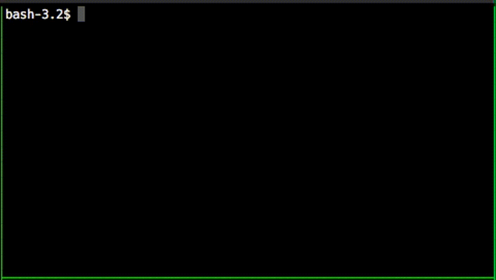
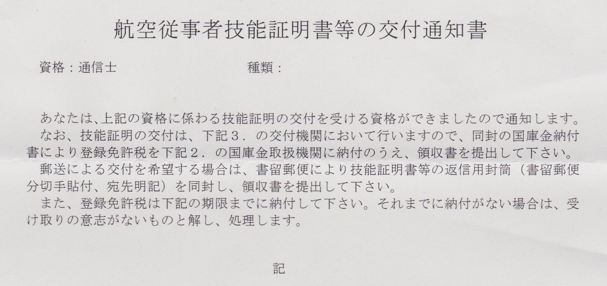

[大特二種](/entry/daitoku2) に続いて使えない免許シリーズ。  
取得者が少ないこともあって Web にあまり情報がないので誰かの参考になればというのと、日記も兼ねて経緯を書き残しておく。

## これは何

航空通信士は航空法に規定された航空従事者の一種で、業務範囲は「航空機に乗り組んで無線設備の操作を行うこと」 [^1]。  
機長、副操縦士、航空機関士、航空士、航空通信士の 5 人で飛行機を飛ばしていた時代の役職で、
現代では 2 人の操縦士が全ての操作をするのでこの資格が使われることがないらしい。

電波法の航空無線通信士と名前が似ているが別の資格である。

これを取得する副作用的なメリットとしては

- 他の航空従事者を受験するときに学科試験の通信の科目が免除される
- 航空身体検査証明を受ければ改めて身体検査を受けずに航空機操縦練習許可書を申請できる [^2]

というのがある [^3] らしいが、一般人にはあまり関係がないし、航空従事者志望でもあまり大きい利点ではなさそう。
結果として、国際民間航空条約の規定に基づいて設けられていて通用力のある割には、あまり使い道がない資格になっている。

航空従事者資格のうち、航空通信士だけは実技試験がなく、学科試験合格と電波法の無線従事者免許 [^4] の
2 つが揃えば技能証明を受けることができる。したがって、航空従事者技能証明の中で一番取得しやすくなっている。

## 2019-05 申請書類の入手

申請書の様式は OCR 用のマークシート式になっていて、国土交通大臣の定める基準に適合するものを使う必要がある [^5]。
個人でマークシートの印刷基準を満たすのは面倒そうだが、民間で既製品が販売されている。
[鳳文書林出版販売](https://www.hobun.co.jp/) の通販「[鳳文ブックス](https://www.hobun-books.com/)」から下記の 2 点を宅配で注文した。

- [学科申請セット(第19号様式)](https://www.hobun-books.com/products/detail.php?product_id=172) -- 学科試験の申し込みに使用
- [技能証明申請セット(第19号の2様式)](https://www.hobun-books.com/products/detail.php?product_id=173) -- 学科試験合格後の発行申請に使用

セットに頼らずバラで買う場合は、

- 第 19 号様式
- 第 19 号の 2 様式
- 指定窓付封筒 -- 3 枚
- 『申請にあたっての注意事項』(任意 -- 申請自体には不要)
- 納付書 (任意 -- 航空法施行規則 第 31 号様式を A4 普通紙で印刷すればよい)

があれば航空通信士の申請には足りるが、値段はあまり変わらないのでセットで買ったほうが間違いがないと思われる。

買える店はいくつかある。多分他にもある。

- http://busterclimb.ocnk.net/product/204
- http://www.fs-cima.co.jp/pilothouse3.html
- http://pilothouse.jp/shop10.htm

## 2019-06-10 受験申請

航空通信士の学科試験は年 2 回、3 月と 7 月に実施されていて、
試験日の 1 ヶ月前ごろの 1 週間程度の間だけ申し込みを受け付けている。
スケジュールや書類の作成要項は [国土交通省の HP](https://www.mlit.go.jp/koku/koku_tk12_000005.html) に書いてある。

せっかくなので東京航空局へ直接書類を提出しにいった。
地下の売店で 5,600 円分の印紙を購入して、運用課検査乗員係にある窓口へ。

申請書の記入で迷ったところが、「所属名又は勤務先」の欄である。提出の際に窓口で聞いたところによると、

- Q: これはどのように書くのがよいか
  - A: 受験票や結果通知書に印字される
  - A: 書類不備などの電話連絡で本人に繋がらない場合ここに記入した番号で連絡を試みる可能性がある
- Q: 「個人」と書いてもよいか
  - A: 構わない

ということだったので、「個人」と書いて電話番号は空欄にして提出した [^6] 。
不備がないかチェックしてもらって申請完了。

<blockquote class="twitter-tweet">
モンスターエナジーが 160 円なの珍しいな (@ 九段第2合同庁舎 in 千代田区, 東京都) <a href="https://t.co/E0BNOu4Bx7">https://t.co/E0BNOu4Bx7</a> <a href="https://t.co/IivXzw4oUu">pic.twitter.com/IivXzw4oUu</a>
&mdash; (@wk) <a href="https://twitter.com/wk/status/1137887315152527361?ref_src=twsrc%5Etfw">June 10, 2019</a></blockquote>

無線従事者免許証は学科試験の申請の時点では要しないが、学科合格後の技能証明書の申請の際の必要書類になっている。
一総通、二総通、航空通の従免がどれもない場合は、別途無線従事者試験も申し込んであらかじめ取得しておくとスムーズになる。

## 勉強する

<blockquote class="twitter-tweet">
これ正答は (3) なのだけど (1) も誤りでないとは言い切れない気がする (GMT だったら間違いないだろうけど) (航空従事者学科試験 2018/03 通信士-航法) <a href="https://t.co/jRycYl1Ugr">pic.twitter.com/jRycYl1Ugr</a>
&mdash; (@wk) <a href="https://twitter.com/wk/status/1140256059472265217?ref_src=twsrc%5Etfw">June 16, 2019</a></blockquote>

国交省のサイトに 3 年間 6 回分の過去問・解答の PDF がある。
問題は体感 9 割以上が過去問から出題される [^7] ので、これを中心に進めると効率がよい。

PDF だとスマホで見づらいので、「スマホで見やすいようにアプリか Web サービスにして勉強しよう」
「実装が終わったら勉強しよう」と思っていたら何もしないまま直前になってしまった。

やっつけで CLI で出題機能を作って、前日の睡眠時間を犠牲にして一夜漬けでなんとかした。

PC しか対応させていないので、試験会場に PC を持っていって行きの電車で問題を解いた。
色々と本末転倒で、点数も危ういところだったが、試験時点にはなんとか 9 割以上まで持ってこれた。

この出題プログラムと問題データ (CSV) は GitHub に置いてある。  
https://github.com/wktk/air-temp

2016, 2017, 2018 年の 3, 7 月分と 2019 年 3 月分、計 7 回分の過去問を PDF から抜き出して CSV にまとめてある。
プログラムは黒い画面に抵抗がない人向けなのでともかく、CSV のデータは Excel などでも使えるはずだと思う。

## 2019-07-13 学科試験

東京外語大府中キャンパスでの実施だった。
自家用操縦士の受験者と一緒の試験室で、学生風の人が多くてにぎやかだった。

操縦士受験生の学生さんが「航空通信士って何？」「さあ？」「取っても使えないらしいよ」などと会話していたのが面白かった。

会場内で航空通信士を受けていたのは 10 人いない程度で、受験番号でいうと 0009 - 0017  だった。
9 から始まるということは他県の会場にも受験者がいるのだろうと思う。

試験自体は過去問を把握していれば難しくなく、解答を反射的にアウトプットするだけなので時間がかなり余る。
マークシートの枠が塗りつぶしではなくて枠の中に線を引くタイプだった。他の受験者に塗りつぶしている人がいてちょっと焦った。

## 2019-08-02 無線従事者試験 (航空無線通信士)

<blockquote class="twitter-tweet">
臨海部に行くついでに早起きして遠回りして舟旅通勤社会実験に来た (@ 日本橋船着場 in 東京都) <a href="https://t.co/yxISziYvQG">https://t.co/yxISziYvQG</a> <a href="https://t.co/A04X3SDA6w">pic.twitter.com/A04X3SDA6w</a>
&mdash; (@wk) <a href="https://twitter.com/wk/status/1157057050599469062?ref_src=twsrc%5Etfw">August 1, 2019</a></blockquote>

技能証明の発行を申請するときに必要になる無線従事者資格の試験。
航空通信士の勉強をしたのに加えて、航空特殊無線技士・第一級陸上特殊無線技士を既に持っていたので事前知識 + α で突破できた。
学生が集団で受験していてかなり騒がしかった。

<blockquote class="twitter-tweet">
点対称だ <a href="https://t.co/7JZGkWiG5N">pic.twitter.com/7JZGkWiG5N</a>
&mdash; (@wk) <a href="https://twitter.com/wk/status/1151790974021931008?ref_src=twsrc%5Etfw">July 18, 2019</a></blockquote>

## 2019-08-09 合格通知

普通郵便で結果通知書が届いた。無事全科目合格していた。
あとは無線従事者免許が手に入れば技能証明書の発行申請ができる。

## 2019-09-13 技能証明の申請

航空無線通信士の無線従事者免許が届いたので、航空通信士の申請もすることにした。

技能証明申請セットについてくる申請用封筒は定形外郵便かつ規格外サイズで、一般書留の指定まで印字されている。
飛行経歴書のような貴重書類を入れるわけでもなく、窓口差出になるし料金も割高なので、
面倒になってクリアファイルに入れてレターパックで送付してしまった。

## 2019-10-08 技能証明書の受け取り

交付の準備ができて、交付通知書と国税納付書が郵便で届いたので、技能証明書を受け取りに行った。

<blockquote class="twitter-tweet">
技能証明の登録免許税、収入印紙では納付できない……？ <a href="https://t.co/50CstQsBO8">pic.twitter.com/50CstQsBO8</a>
&mdash; (@wk) <a href="https://twitter.com/wk/status/1180162213656424450?ref_src=twsrc%5Etfw">October 4, 2019</a></blockquote>

東京航空局と同じ建物の 1F に入っている麹町税務署で登録免許税 3,000 円を現金で納付した。
そのまま上の階の東京航空局の窓口に交付通知書と納付証を持っていき、技能証明書を受け取った。

<blockquote class="twitter-tweet">
航空従事者になった (？) <a href="https://t.co/hgQllIQz1T">pic.twitter.com/hgQllIQz1T</a>
&mdash; (@wk) <a href="https://twitter.com/wk/status/1181429935468154880?ref_src=twsrc%5Etfw">October 8, 2019</a></blockquote>

航空通信士で航空従事者を自称するのは、本職の人からすれば小型特殊車免許で自動車運転免許を自称するようなものかもしれない。

C4 は航空通信士の資格コード。番号から、取得者が 400 人いないことが推測できる。

## 所感

自動車運転免許と小型船舶操縦免許を取得して、陸・海ときたら空だなという安直な発想から興味を持った航空従事者技能証明を取得できた。
本当は操縦がしたい。お金・時間・健康を蓄えて、いつか操縦士資格を取得して陸海空を制覇するのが夢である (？)。

一般向けの免許ではないのに一般人が取得できるルートがあるという点では、
かつて大型二種免許経由で取得できた動力車操縦者運転免許 (= 鉄道の運転士資格) にも似ているところがある。
航空通信士は現代では使われず、国際民間航空条約でも資格を設けることが必須とされていないようなので、制度上の意義も希薄化していると思われる。
動力車操縦者と同様に、航空従事者等技能証明を一般人が取得できるルートがなくなる可能性もあるかもしれない。
もし取得してみたいと思うなら早いに越したことはないと思う。

[^1]: 航空法 28 条別表
[^2]: 国土交通省航空局通達「航空機操縦練習許可申請要領」より
[^3]: 他にも Breitling 社の遭難信号発信機付き腕時計 [Emergency] の日本正規品の購入者資格要件を満たせるというのもある
[^4]: 第一級総合無線通信士、第二級総合無線通信士、航空無線通信士のいずれかが必要
[^5]: 航空法施行規則 239 条の 2 第 1 項
[^6]: もっとも、届いた受験票の所属欄は空欄になっていたので空欄でもよいのだと思う。合格後の交付申請書 (19 号の 2 様式) の所属欄は空欄で出した。空欄として扱われるとしても、あえて「個人」と書くことで書き忘れではないと示す効果はあるかもしれない。
[^7]: 残りの 1 割未満が新問なのか覚えていないだけなのかは自分にはわからない

[Emergency]: http://www.breitling.co.jp/emergency/qualifications/index.php
