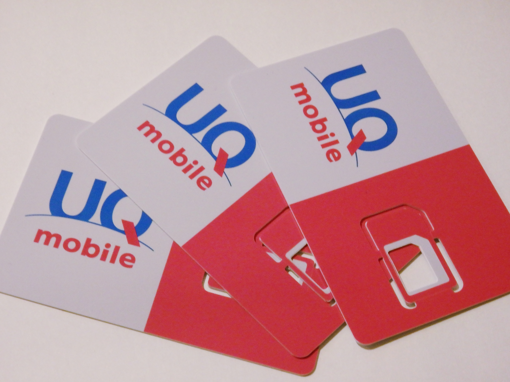
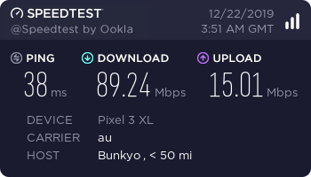

最近 UQ mobile のプランが改定されて、MVNO 他社と似たシンプルなプランで価格帯も近くなってきたので、
UQ mobile に乗り換えた。

もともと何年もスマホの主回線は IIJmio を使っていた。
ピーク時に遅いのは割り切っていて、かつ許容できるレベルだったので不満は感じていなかった。

一方、Y! mobile や UQ mobile がピーク時でも回線速度が速いのは知ってはいたけれど、
料金プランの複雑さ・割安感の薄さや 2 年縛りがまるで大手キャリアのようで、あまり食指が動いていなかった。

ところが、10 月の改正総務省令施行を受けたプラン改定で UQ mobile のプランもシンプルになった。
敬遠していた理由がなくなって、速度が安定していて値段もあまり変わらない状況になったので乗り換えることにした。

<blockquote class="twitter-tweet" data-dnt="true">
最近 UQ mobile にして、ピーク時遅くならないし、10 月のプラン改定で他社との価格差もあまりなくなったので、推せる
&mdash; ឵឵ ឵ (@wk) <a href="https://twitter.com/wk/status/1207281628629762048?ref_src=twsrc%5Etfw">December 18, 2019</a></blockquote>

公式の Web から MNP を申し込むと ¥6,000 のキャッシュバックがあって、また Amazon
でエントリー パッケージを購入しておくことで契約事務手数料がかからずに済む。
これは簡単で良いのだが、もっと好条件を出しているところがある。

Twitter なんかで検索すると、店舗型の代理店で週末に ¥15,000 - ¥20,000
のキャッシュバックをやっているところが見つかる。au 系からの MNP
は対象外とするところが多いが、額は目減りするものの対象にしている店もある。
店舗では契約事務手数料 (¥3,300) がかかるが、キャッシュバックはそれ以上になる。

自分は代理店で申し込んで docomo 系 (¥20,000) × 2 + au 系 (¥15,000) × 1 で ¥55,000 になった。
Web で済むものをわざわざよい条件の店舗を探し出して取置依頼の電話をし、
訪問して 30 分手続きするのは面倒だけれど、複数回線があったり土日暇があるならまあありかと思う。
頻繁にするものでもないし……。

速度の方はかなり改善した。
特に、平日昼のピーク時には Twitter の画像読み込みがもたつくことが多かったが
UQ に変えてからは全く気にならなくなった。
ピーク時以外の速度も全体的に上がっていて、自宅の VDSL の光回線とあまり変わらない速度が出たりする。
