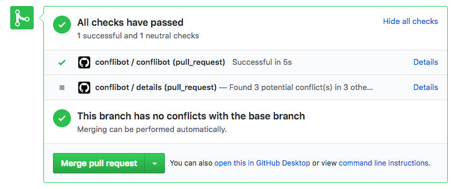

## 背景

Pull request をまとめてマージしてみたらいくつかがコンフリクトして面倒、という場面がある。
これがデプロイ作業前のように忙しいタイミングだとややこしいので、マージすると初めてコンフリクトするような Pull request 同士を事前に検出する GitHub Actions を作った。

Marketplace: https://github.com/marketplace/actions/conflibot  
Repository: https://github.com/wktk/conflibot

## 動作

中では下記の流れで処理をしている。

- pull_request イベントで起動
- 現在の Pull request を Action 内でマージ
- マージ先が同一の他の Pull request を取ってきて、`git apply --check` で適用をチェックしてみる
- コンフリクトを検出した場合
  - Neutral の commit status を設定
  - Commit status の Details へコンフリクトのある PR, ブランチ、ファイル、行を出力

## 利点

類似の actions と比べて、次のような利点がある。

- `git apply --check` の出力結果を利用しているので「コンフリクトが本当に起きるか」「起きるならどのファイルのどの行か」を比較的正確に取得できる
- JavaScript [^1] の action なので、(Dockerfile のようにビルドが走ることなく) 実行時間が短くて済む

## 設定

設定ファイルは下記の形式になっている。
(今のところ) あまりオプションはないが、コンフリクトを検出しても無視するファイル名のパターンを指定できるようにしている。

```yml
name: conflibot
on: pull_request

jobs:
  conflibot:
    runs-on: ubuntu-latest
    steps:
      - uses: actions/checkout@v2
      - name: Warn potential conflicts
        uses: wktk/conflibot@v1
        with:
          github-token: ${{ secrets.GITHUB_TOKEN }}
          exclude: |
            yarn.lock
            **/*.bin
```

## 課題

次のような課題が残っている。

- 同時に他の GitHub Actions が動作すると、commit status の名前が違ってしまうことがある
  - GitHub 側の問題のよう https://github.community/t/github-actions-status-checks-created-on-incorrect-check-suite-id/16685
- Pull request を最初の 1 ページしか取得していないのを全て取得できるようにする
- コンフリクト検出部分とGitHub 連携部分との密結合を修正する
  - 合わせてテストを書く

## おわりに

自分の使うパターンしかテストしていないので、不具合がある可能性は十分ある。
万一使ってみたという人がいれば、気づいたことがあるときはぜひフィードバックを頂けるとありがたい。

[^1]: 実装は TypeScript で行い、JavaScript に変換している
