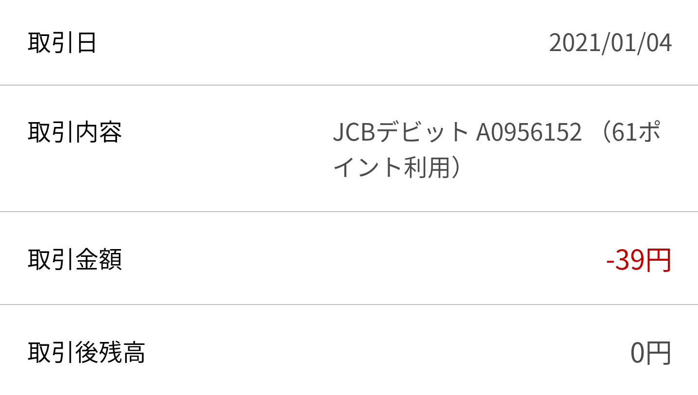

楽天ポイントを Amazon ギフト券残高に変換する方法を検索すると、一旦
Edy にチャージして決済する方法がヒットする。
しかし、楽天銀行デビットを持っていれば、Edy を使わなくても
楽天ポイントを Amazon の購入に使用したり、ギフト券残高へチャージしたりできる。

方法は簡単で、

1. [楽天銀行] 口座を用意する
    - [楽天銀行デビットカード] を付帯した口座
    - [楽天会員リンク登録] で楽天銀行の口座と楽天会員とを紐付けておく
1. 「[デビットの支払いにポイントを使う]」機能を設定する
    - 「[カード・ATM]」→ 「設定状況」→「ポイント利用設定」と進むと設定できる
1. 上記の楽天銀行デビットカードで [Amazonギフト券 チャージタイプ] を購入するか、直接買い物の決済に使用する

このようにすると、設定内容に合わせて楽天ポイントがデビット決済に充当される。
用意は必要だが Edy にチャージする手間がかからない。
また、一度設定すれば次からは Amazon 側で決済方法として選択するだけでスムーズに使える。
最初の画像のように楽天ポイントと楽天銀行口座残高の併用設定もできる。

[デビットの支払いにポイントを使う]: https://www.rakuten-bank.co.jp/debit-card/feature/point-use/
[楽天銀行]: https://www.rakuten-bank.co.jp/
[楽天銀行デビットカード]: https://www.rakuten-bank.co.jp/debit-card/
[楽天会員リンク登録]: https://www.rakuten-bank.co.jp/link/
[カード・ATM]: https://www.rakuten-bank.co.jp/d-login/?ServiceID=s011
[Amazonギフト券 チャージタイプ]: https://www.amazon.co.jp/gp/product/B08G1PWN9X/?tag=4217986871-22
