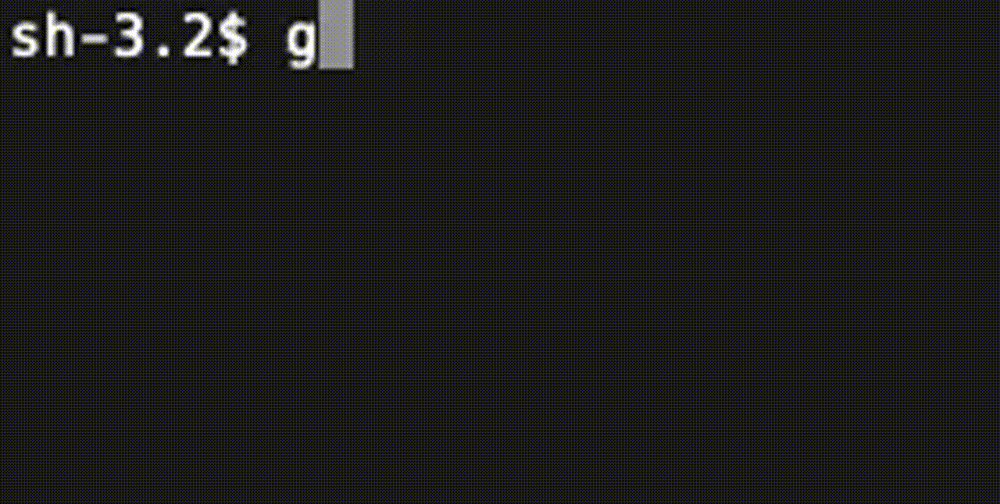

最近、画面との付き合い方を考え直していて、以前から使っていた Night Shift
に加えてスクリーン タイムや夜間のモノクロ表示の設定を追加したりしている。

Android では夜間に通知をオフにして画面をモノクロにする Bedtime mode に
スケジュール機能がついているが、macOS で同じようなことをしようとすると
アクセシビリティのメニューを開いて手動で on / off しなければならない。

手慣れていていつも開いている Terminal から操作できれば、メニューをたどる
必要がないし連携や拡張する自由度も高い。
そこで、CLI から Night Shift やグレースケールを操作するコマンドを書いた。

## コード
### Night Shift を操作する

macOS のフレームワークを呼び出しているので、コンパイルする言語の方が実装が
いくらか楽な気もするが、dotfiles に入れてちょっとした感じで使いたかったので、
AppleScript で実装した。
PATH の通った場所に保存して実行のパーミッションをつけてあげればコマンドとして呼べる。

```applescript
#!/usr/bin/osascript

-- macOS: Control Night Shift from commandline
-- usage: $ nightshift [0...100|on|off]
-- note:  num corresponds to color temperature. 0 = off, 100 = warmest

use framework "CoreBrightness"

on usage()
	return "Usage: nightshift [0...100|on|off]"
end usage

on run argv
	if (count of argv) = 0 then
		return usage()
	end if

	set client to current application's CBBlueLightClient's new

	try
		set strength to item 1 of argv as number
		if strength = 0.0 then
			client's setEnabled:false
			return "Turned Night Shift off"
		end if

		client's setEnabled:true
		client's setStrength:(strength / 100.0) commit:true
		return "Turned Night Shift on, and set its strength to " & strength
	on error
		set mode to item 1 of argv

		if mode = "off" then
			client's setEnabled:false
			return "Turned Night Shift off"
		else if mode = "on" then
			client's setEnabled:true
			return "Turned Night Shift on"
		end if
		return usage()
	end try
end run
```


### グレースケールを操作する

プライベート API (?) のせいか、AppleScript ではうまく実装できなかった。
不格好だが、中で Python から操作している。
これも、PATH の通った場所に保存して実行のパーミッションをつけてあげればコマンドとして呼べる。

[Toggle System Grayscale Mode | Indie Stack](https://indiestack.com/2019/04/toggle-system-grayscale-mode/)
を参考にした。

```bash
#!/usr/bin/env bash

# macOS: toggles screen grayscale
# usage: $ grayscale [on|off]
# note:  toggles when no args provided

arg="lib.UAGrayscaleIsEnabled() == 0"

if [ ! -z "$1" ]; then
	if [ "$1" = "on" ]; then
		arg="True"
	elif [ "$1" = "off" ]; then
		arg="False"
	else
		echo "usage: $0 [on|off]"
		exit 1
	fi
fi

python <<-EOF
	from ctypes import cdll
	lib = cdll.LoadLibrary("/System/Library/PrivateFrameworks/UniversalAccess.framework/UniversalAccess")
	lib.UAGrayscaleSetEnabled($arg)
EOF
```



### 所感

あまり触ることのない AppleScript を手探りで書いてみて楽しかった
