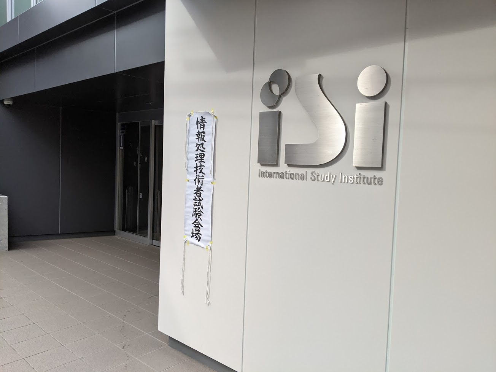
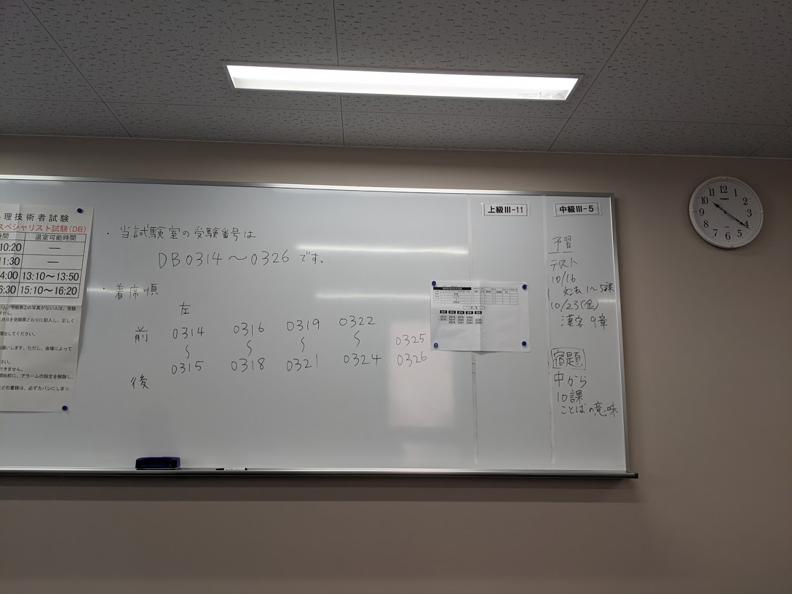

## 経緯
[2015 年春の情報セキュリティスペシャリスト](/entry/2015/06/22/213943/)、
2015 年秋のネットワークスペシャリストに合格して以来、新しい区分に合格した。

SC と NW を取ってから、次に DB を取ると決めて 2016 年, 2017 年に受験していた。
しかし、いずれも午後 2 が数点足りず不合格だった。

午前 1 免除を維持しなかったので、若干腰が重くなってきていたが、2020 年に再受験して合格した。

<blockquote class="twitter-tweet" data-lang="en" data-dnt="true">
データベーススペシャリストも技術士一次も受かってたから良かった <a href="https://t.co/s1ufkwB5ck">pic.twitter.com/s1ufkwB5ck</a>
&mdash; ᅠ (@wk) <a href="https://twitter.com/wk/status/1342486281138290689?ref_src=twsrc%5Etfw">December 25, 2020</a></blockquote>

## 勉強

今回の情報処理技術者試験は技術士一次試験のちょうど 1 週間後のタイミングで、時間を工夫する必要があった。
したがって、知識修得を中心にした。

午前 1 は十分合格できそうだったため対策なし。
午前 2 対策を重点的にして、知識を正確に入れることに時間を割いた。

午後試験は問題の形式を確認する程度で、午前 2 対策のインプットを応用して解くことにした。
技術士一次の終了からの 1 週間に集中して、SC, NW に使ったのと同じシリーズの本の午前 2 対策を読み込んだ。

[ポケットスタディ データベーススペシャリスト\[第2版\]](https://www.amazon.co.jp/dp/4798045268/?tag=4217986871-22)

## 本番

感染症対策で春試験が秋に延期になった。
また、会場も少人数で、間合いを取って実施された。

半分くらいは空席だった。
午前 1 で帰る人も意外といた。
もともと少人数の試験室だったので広く感じた。

午後試験の記述は、時間に追われながらかろうじて解いた感触だった。
記述は練習してコツを掴んでおけば有効に思えた。
答案用紙はほとんど記入したものの、合格ラインに届く自信は半々程度だった。

## 今後

キャリアの方向性を検討するに、次にシステムアーキテクト試験 (SA) を受けて、考え方を身につけておきたい。

また、プロジェクトマネージャー試験 (PM), IT ストラテジスト試験 (ST) あたりの内容をその先の目安にしてみるのも悪くなさそう。
実際にその方向に進むのかは別途考えるとしても、隣接職種の考え方を知ることで、広い視野、色々な立場の視点をもてればよいと考えている。

いずれにせよ、午後の記述科目が論述式になるので十分な対策が必要になってくる。
論述対策を計画的にして臨みたい。
