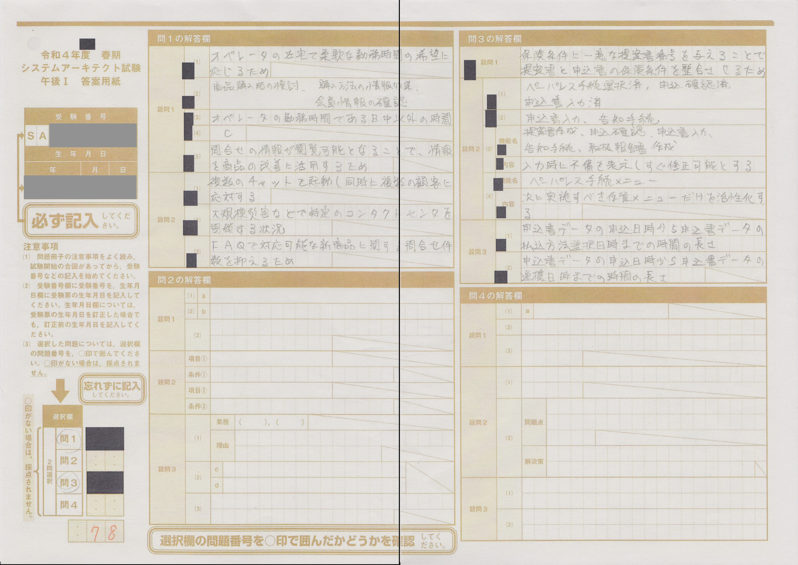
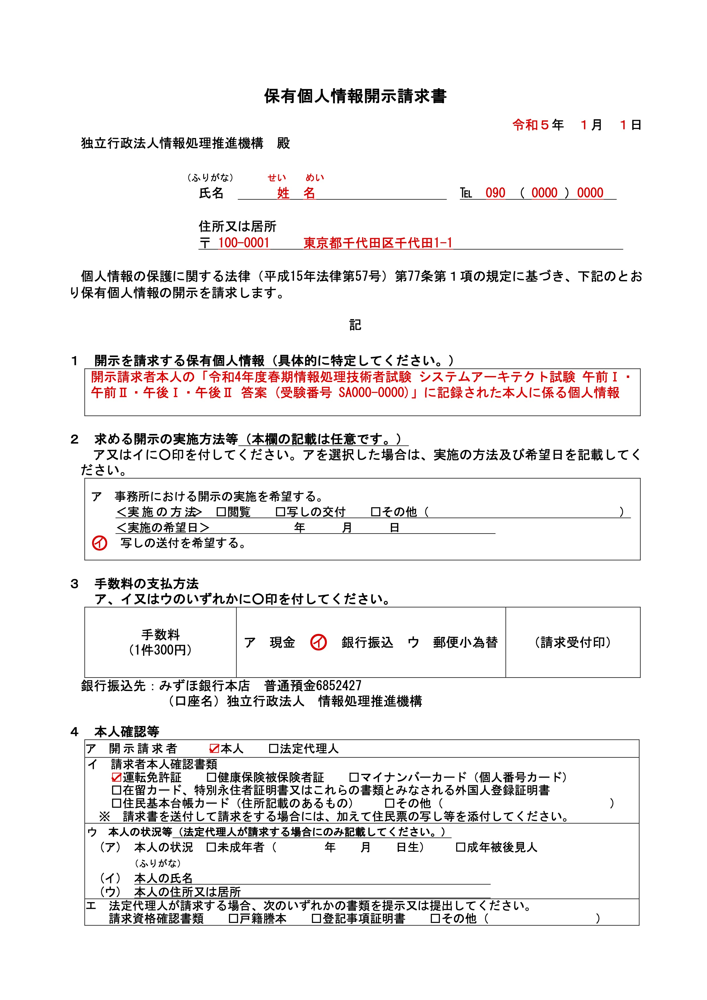

## はじめに

情報処理技術者試験の筆記試験では、試験の問題冊子を持ち帰ることができるが、答案用紙は当然回収されてしまう。
そのため、解答を控えておきたい場合は問題用紙に写すのが一般的だが、特に記述式・論述式の科目ではその余裕がないことも考えられる。

実は、提出した答案用紙は簡単な手続きをすれば開示してもらえるので、本稿ではその手順を説明する。
答案用紙を開示してもらうと、解答の正確な内容を見直すことができるため、
本番の実力にに基づいて良い点・悪い点を振り返ることで自身の学習に役立てられるといったメリットがある。
保有個人情報開示請求というとぎょっとするかもしれないが、行政機関が実施する試験には成績や答案の開示を
保有個人情報開示請求の枠組みで行うものが少なからずあるため、身構えるものでもないと考えている。

なお、採点作業に関する情報 (設問個別の配点がわかる部分など) の部分は、開示すると試験の遂行に支障があるとされているため、
マスキングして開示される。

※ CBT 方式の試験区分については詳しくないため本稿では考慮しないが、試験内容が非公開で運営される仕組み上、開示はできないかもしれない。

## 手順

大まかな流れは情報処理推進機構の [保有個人情報開示請求] のページに記載されている。
ここでは、情報処理技術者試験の答案用紙の開示に絞ってより具体的に説明する。
なお、執筆時点では、申請は郵送でのみ受付とされている。

### 0. 必要なもの

- 郵送・窓口共通:
  - 開示請求手数料: 1 件 300 円
    - 1 回の試験を 1 件とカウントする
  - 本人確認書類 (現住所・氏名が記載され、法令に基づいて交付された文書)
    - 例: 運転免許証、健康保険証、個人番号カード
- 郵送の場合:
  - 切手 x 3
    - 開示請求書の提出用: 84 円
    - 開示実施方法申出書の提出用: 84 円
    - 答案コピーの郵送料の実費相当: 120〜140 円程度 (実際の文書の量に応じて通知される)
  - 「住民票の写し」の原本 (= 住民票記載事項証明書)
    - 発行から 30 日以内で、マイナンバーが記載されていないもの
    - 本人分のみでよく、世帯全員が記載されている必要はない
  - 郵送用の封筒など

### 1. 開示請求書の作成

「[各種請求書の入手]」のページから、「保有個人情報開示請求書」をダウンロードする。
2 ページ目の説明も参照しながら、下記の例の赤字部分の要領で記入していく。

印刷は A4 用紙に行う。
記入は、入力してから印刷する方法、印刷してから手書きする方法、どちらでも (または組み合わせても) 問題ない。

「開示を請求する個人情報」は次の要領で、`<>` 内を適宜記入する。

> 開示請求者本人の「<試験期> 情報処理技術者試験 <試験区分> <開示を希望する科目> 答案 (受験番号 <自分の受験番号>)」に記録された本人に係る個人情報

「手数料の支払方法」は、窓口に持参して手続きする場合は「ア 現金」、郵送で手続きする場合は「イ 銀行振込」か「ウ 郵便小為替」を選択する。
「請求者本人確認書類」は自分が持っているものを選択する。

### 2. 手数料の支払い

開示請求と同時に、1 件 300 円の手数料を支払う必要がある。

窓口の場合は、提出時に現金で支払う。郵送で銀行振込の場合は、郵送のタイミングで、開示請求書に記載の銀行口座へ振り込む。
郵送で郵便小為替の場合は、300 円分の定額小為替証書をゆうちょ銀行で購入して同封する。

### 3. 開示請求書の提出

窓口持参で手続きする場合は、次のものを提出する。

- 作成した開示請求書
- 本人確認書類の原本 (提示)
- 開示請求手数料 300 円

郵送する場合は、[窓口] のページに記載されている宛先に、次のものをまとめて郵送する。

- 作成した開示請求書
- 本人確認書類のコピー
- 住民票の写し (住民票記載事項証明書)
- (郵便小為替の場合のみ) 300 円分の定額小為替証書

開示請求書の「（説明）」のページは送る必要はない。

提出したあと、内容確認などの電話がかかってくる場合がある。
原則 30 日以内 (実際は 1 - 2 週間程度?) に「開示決定通知書」「開示の実施方法等申出書」などが郵送されてくる。

### 4. 実施方法等申出書の提出

「開示決定通知書」「開示の実施方法等申出書」が届いたら、30 日以内に
「開示の実施方法等申出書」を送り返すと、実際に開示を受けることができる。
開示される答案を郵送してもらう場合、送料相当の切手も一緒に提出する。

ちなみに実施方法等申出の際には「[開示実施手数料]」の規定があるが、先に支払った「開示請求手数料
(300 円)」分が差し引かれるため、情報処理技術者試験の答案を開示する場合は通常、ここで支払いは発生しない。
コピーを受け取る場合は見開き 1 枚ごとに 20 円だが、枚数が多い論述式の試験区分でも
午前I・午前II・午後Iで各 1 枚、午後IIが 8 枚程度となるので、無料の範囲に収まる。

申出書の記入に際しては、記載例が一緒に送られてくるので、それを見ながらやれば作成できる。
申出書を作成したら、「3. 開示請求書の提出」と同様に、次のものを [窓口] の宛先まで提出する。

- 作成した「開示の実施方法等申出書」
- 郵送受け取りを希望する場合:
  - 切手 (「開示決定通知書」に記載された金額分)

### 5. 受け取り

大体 1 - 2 週間程度で、開示された答案用紙が郵送されてくる。
記事冒頭の画像は実際に開示された答案用紙で、黒の塗りつぶしは非開示になった部分、グレーの塗りつぶしはこの記事で公開するために塗りつぶした部分である。

## 備考

### 請求のタイミングについて

- 答案用紙には保存期間があるはずで、その期間が経過すると文書が破棄されるはず。その場合、コピーを受け取ることはできない。
  - 未確認だが、1 年程度か?
- 試験日から合格発表の間に開示請求をすると、採点や合格発表との兼ね合いですぐに出てこないかもしれない
  - これも未確認

[保有個人情報開示請求]: https://www.ipa.go.jp/about/personal/seikyu/index.html
[各種請求書の入手]: https://www.ipa.go.jp/about/personal/seikyu/sinsei.html
[窓口]: https://www.ipa.go.jp/about/personal/seikyu/madoguchi.html
[開示実施手数料]: https://www.ipa.go.jp/about/johokokai/seido/kitei/chargetable.html
