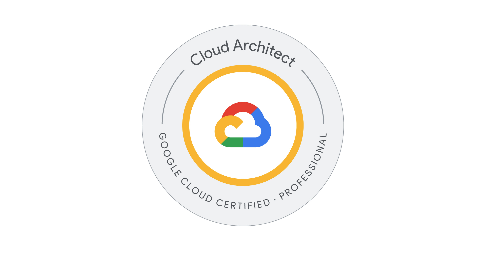

## はじめに

2025 年春に開始された Google Cloud Professional Cloud Architect (PCA) の短縮版更新試験 ([Google Cloud Certified - Professional Cloud Architect Renewal](https://cloud.google.com/learn/certification/cloud-architect?hl=en)) を受験してきた。2023 年 7 月に初めて PCA 試験を受け、ちょうどその更新時期だったので受験し、無事合格できた。

Web 上にはまだこの更新試験に関する情報が少ないので、今後受験する人の参考になればと思い執筆することにした。なお、本記事は 2025 年 7 月受験時点での体験談であり、時期や受験者によって状況が異なるかもしれない。

## 試験の概要

更新試験は受験料が $100・試験時間が 1 時間となっていて、$200・2 時間の標準試験に比べて時間的・金銭的負担が大幅に軽減されている。ただし執筆時点では、試験は英語のみで提供されている。

なお、Renewal 試験の案内は公式ページ ([Professional Cloud Architect Certification](https://cloud.google.com/learn/certification/cloud-architect?hl=en)) を英語版にしないと表示されないので注意が必要。基本的な試験情報は公式ページと試験ガイド ([Certification exam guide](https://services.google.com/fh/files/misc/professional_cloud_architect_renewal_exam_guide_eng.pdf)) を読めば把握できる。

試験内容は生成 AI ソリューションに特化した設問が中心で、専用の 2 つのケーススタディ (Cymbal Retail または Altostrat Media) のうち 1 つが出題される。

## 試験申し込み前

初回更新時には 50% 割引クーポンがもらえるらしいが、筆者の場合は通知も付与も見当たらなかった。サポートに問い合わせたところ再発行してもらえたので、クーポンがもらえるはずの人は一度サポートに確認すると良さそう。

また、サポートに問い合わせるついでに、この試験が英語のみかどうかも確認したところ、英語のみとの回答だった。なお、更新元の試験を日本語で受けた人でも受験できるとのこと。

## 申し込み

初回試験と同じ CertMetrics アカウントでログインし、WebAssessor で予約する。「Google Cloud Certification Exams - English」メニューの中に試験がある。受験資格がある場合にのみ「Google Cloud Certified - Professional Cloud Architect Renewal (English)」が表示される。前回日本語で受験した場合でも、English のリストからたどる必要がある。

自分は環境準備が面倒なので会場受験派。$100 + 税のところ、50% バウチャーが適用されて $50 + 税、合計 $55 で受験できた。通常試験の半額である上に、さらに半額になるのはありがたい。

## 筆者の受験背景

筆者は有効期限が失効して 30 日の更新猶予期間に入っていた。不合格の場合に、強制インターバル中に猶予期間が満了して更新試験の受験資格を失うリスクも考えられた。これを避けるため、数日後の日程で一旦予約を入れたが、まとまった学習時間は確保できていない状況での受験となった。

Google Cloud は触れる機会はあるものの、深くは触っていないレベル。英語のペーパーテストは得意だったので、英語が苦手な人には参考にならない部分もあるかもしれない。

## 勉強

### 公式ガイドの確認

まず下記の公式資料に目を通した。

- [Certification exam guide](https://services.google.com/fh/files/misc/professional_cloud_architect_renewal_exam_guide_eng.pdf) - 試験の構成と出題範囲
- [Cymbal Retail Case Study](https://services.google.com/fh/files/misc/cymbal_retail_case_study_english.pdf) - 製品カタログの管理と顧客体験向上のために生成 AI を活用したいオンライン小売業者のケース
- [Altostrat Media Case Study](https://services.google.com/fh/files/misc/altostrat_media_case_study_english.pdf) - メディアコンテンツ管理とユーザーエンゲージメントを生成 AI で改善したいメディア企業のケース

ケーススタディの内容はどちらか片方が出題され、試験中にも確認できるが、事前に把握しておくと良さそう。

### Cloud Skills Boost の活用

公式の Cloud Skills Boost ([Professional Cloud Architect Renewal Exam Learning Path](https://www.cloudskillsboost.google/paths/1834)) の activities を部分的に確認した。最初の GenAI と LLM の紹介は一般的な内容のため、知ってる人は飛ばしても問題なさそう。

Labs (ハンズオン) には Credit がかかるものとかからないものが存在したが、Credit がかからない範囲で一通りやってみた。Vertex AI Studio と Colab が中心的な内容だったが、試験に直接役立ったかはなんとも言えない。ただし Google Cloud の AI を触っていなかったため、雰囲気や土地勘をつかむのには有用だった。

コース動画は結構時間が長そうで視聴できなかったが、試験後の感想としては見ておくと役立ったと思われる。

### 通常範囲の復習

普段 Google Cloud をあまり触っていないため、忘れている概念などがないかざっと見直しした。通常の PCA の知識は当然前提とされているように感じたので、生成 AI だけ対策するのではでなく、PCA の知識も復習しておくと良さそう。

## 試験当日

25 問を 1 時間で解答する形式で、Vertex AI に絡めたケーススタディが中心だった。

難易度は通常試験と変わらない感覚だった。時間と問題数が少ない分、負担は軽いように思う。ちゃんと知識があれば普通に解けるという印象を受けた。従来の試験と同様、サービスで何ができるか、サービスの使いどころ、ベストプラクティスを把握しているかが問われている感覚だった。

### 時間配分

試験時間の前半では、まず全問を埋めることを優先した。悩む問題は見直しのチェックボックスをつけ、仮の解答を入れて進め、得点できる問題を確実に得点できるよう配慮した。後半では見直しと、悩む問題の長考に時間を充てた。

サービス内容を詳しく知らなくても、論理的に導ける問題もいくつかあった。ちゃんと予習していれば半分の時間でも十分埋められそうと感じた。

### 英語について

英語のドキュメントを読まざるを得ないときに英語のまま読めるレベルであれば大丈夫だと個人的には思う。英語力の試験ではないため、わざと難解すぎる語彙や文法が出てくることはない。

## まとめ

時間とコストの負担が軽いので、更新試験はお勧めできる。近年急成長している AI 分野のキャッチアップになるのもよかった。ただし、英語が苦手な場合や、Vertex AI よりも従来の知識で受験したい人は通常試験を選択するのが良さそうと感じた。

試験対策としては、Vertex AI のキャッチアップ、ケーススタディの内容把握、通常試験範囲の復習であたりになりそう。受験後の感想として、もう少し時間があれば Vertex AI をより深く触っておくのと、通常範囲の復習をしっかりやっておきたかったと感じた。

なお、合格時にもらえるグッズは 2025 年 3 月 15 日で廃止されたらしい（[参考](https://www.reddit.com/r/googlecloud/comments/1jjraet/certification_swag_discontinued/)）。
